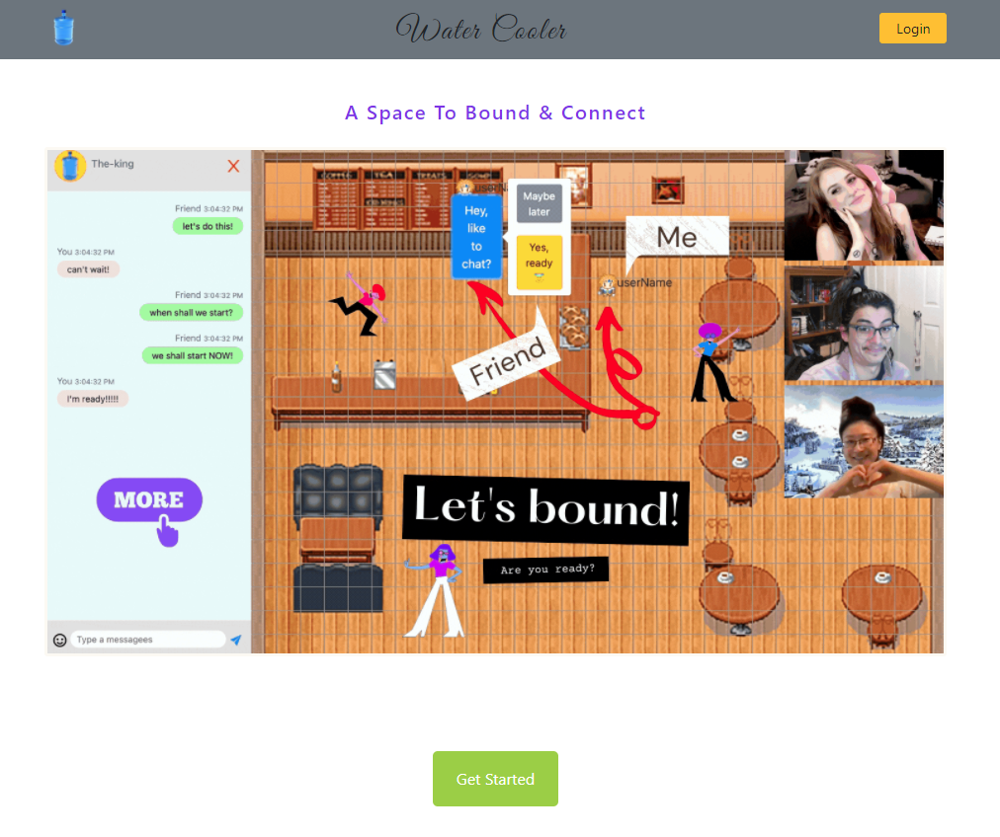
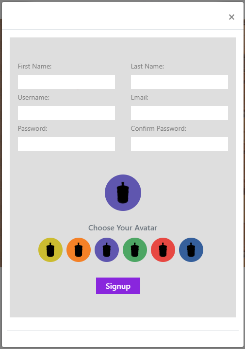
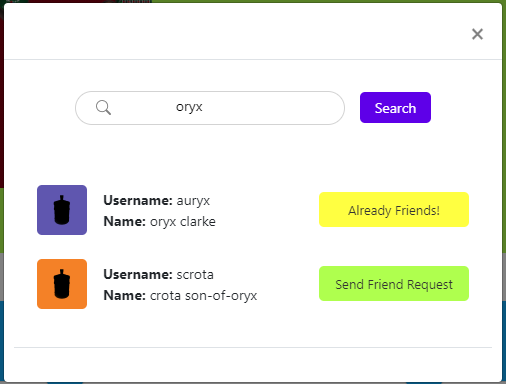
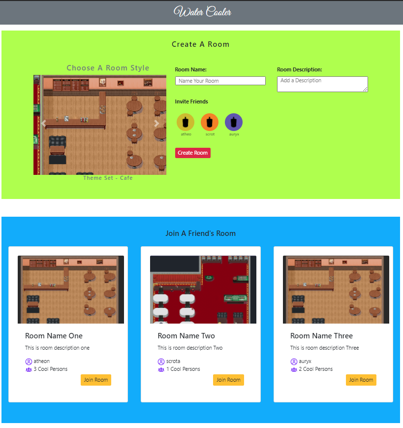
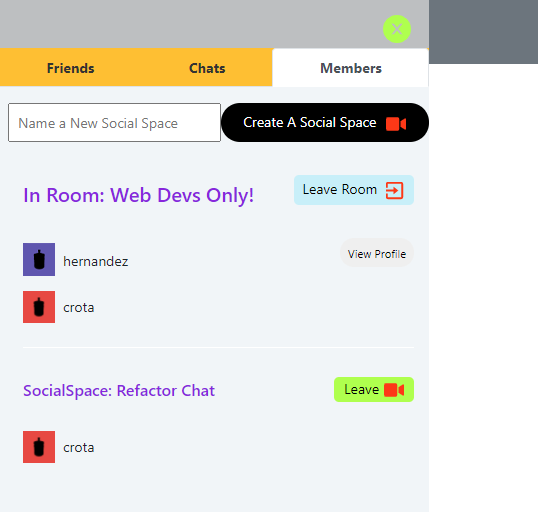

# Water Cooler

## Deployed Heroku Link
WaterCooler https://thawing-sands-06990.herokuapp.com/
## Description

&NewLine;
&NewLine;



This is an MVP build of a MERN-stack video conferencing web application with a unique, sprite-based GUI for creating social spaces to chat with large groups. The goal is to recreate the real world movement/interactions that one would do when walking around a real-world office or party space.

When in a room, users can move their sprites to interact with their friends and create Social Spaces. These Social Spaces are where users can cluster together and host chats while still being able to move to different Social Spaces to engage with their other friends in the room.

The goal of this MVP build is to have:

- Installable PWA with limited offline functionality
- Secure authentication for creating accounts and blocking unauthenticated users from accessing certain pages
- Friends system for accepting/declining friend request, viewing friends, and unfriending users
- Users can create and invite friends to unique Rooms
- Each user in a room can move freely in the GUI
- Users can create and invite room users to social spaces
- Each Social Space has a unique text chat, visible only to users in that space
- Users can move between Social Spaces freely

[Create an account](https://water-cooler-main.herokuapp.com/) or jump to [Usage](#Usage) to see how it works!

## Table of Contents

- [Usage](#Usage)
- [Development](#Development)
- [Bugs](#Bugs)
- [Future Development](#Future-Development)
- [Contributors](#Contributors)
- [Contact](#Contact)
- [Reference Material](#Reference-Material)
- [License](#License)

## Usage

- Begin by creating an account. You can update these details in your profile page



- Then find your friends using the search icon



- Now you can create a room and invite your friends from the home screen
- You can also join any open rooms that your friends are hosing!



- Once in a room, you can move your sprite around the room to interact with your friends!
- Currently, the sidebar is where you will create and join Social Spaces.



- The chat tab will change conversations depending on your current location. You will see either the general room chat or the chat of your Social Space
- We plan on adding video chats very soon!

This application is far from finished so we would love to hear your feedback! See [Future Development](#Future-Development) and [Bugs](#Bugs) for our development plans and [Contact](#Contact) on how to reach us!

# Development

- [Technology Overview](#Technology-Overview)
- [Installation](#Installation)
- [Available Scripts](#Available-Scripts)
- [Dependencies/Packages](#Dependencies/Packages)
- [Server](#Server)
- [Client](#Client)
- [Tests](#Tests)

## Technology Overview

&NewLine;
&NewLine;

```sh
Frontend – React, socket.io-client, Bootstrap, React-icons, React-Toastify, use-sound, uuid 
Backend – Node, express, socket.io
Database – Mongodb, Mongoose
Authentication – Express-session, passport-local, bcrypt
Testing – react-testing-library, jest, supertest
```

## Installation

We are currently not accepting any pull requests but you are welcome to view and experiment with our code. Please [Contact](#Contact) us if you have any feedback! You must have [node.js](https://nodejs.org/en/) and [mongoDB](https://www.mongodb.com/) installed on your local machine to run this app. [Robo3T](https://robomongo.org/download) is also recommended for managing the database

- [Fork](https://docs.github.com/en/github/getting-started-with-github/fork-a-repo) the repo to your GitHub account.
- Use your preferred, git connected terminal to clone the project to your local machine.
- Use your terminal to navigate to the root folder and run `npm i` to install all the dependencies for the server and client

Follow the rest of this README to understand how our app works. Our code is well commented so you may find more insight looking at the code as well.

## Available Scripts

These are some of the key scripts used during development. They all must be run from the root folder.

| Script | Description |
| ------ | ------ |
| npm start:server | Begin server using nodemon |
| npm start:client | Begin React server in dev mode |
| npm lint | Use eslint to check for linting errors |
| npm lint:fix | If an issue occurs with eslint, this script can resolve the issue |
| npm test:server | Run tests for the server |
| npm test:client | Run tests for the client |

&NewLine;
&NewLine;

> [Back To Development](#Development) || [Back To Table of Contents](#Table-of-Contents)

&NewLine;
&NewLine;

## Dependencies/Packages

&NewLine;
&NewLine;

| | | | |
| ------ | ------ | ------ | ------ |
| [bcryptjs](https://www.npmjs.com/package/bcryptjs) | [bootstrap](https://www.npmjs.com/package/bootstrap) | [concurrently](https://www.npmjs.com/package/concurrently) | [dotenv](https://www.npmjs.com/package/dotenv) |
| [express](https://www.npmjs.com/package/express) | [express-session](https://www.npmjs.com/package/express-session) | [jsonwebtoken](https://www.npmjs.com/package/jsonwebtoken) | [mongoose](https://www.npmjs.com/package/mongoose) |
| [passport](https://www.npmjs.com/package/passport) | [passport-local](https://www.npmjs.com/package/passport-local) | [react-bootstrap](https://www.npmjs.com/package/react-bootstrap) | [react-icons](https://www.npmjs.com/package/react-icons) |
| [react-loader-spinner](https://www.npmjs.com/package/react-loader-spinner) | [socket.io](https://www.npmjs.com/package/socket.io) | [socket.io-client](https://www.npmjs.com/package/socket.io-client) |
| [Use-sound](https://www.npmjs.com/package/use-sound) | [uuid](https://www.npmjs.com/package/uuid) | [yarn](https://www.npmjs.com/package/yarn) |

&NewLine;
&NewLine;

### Dev Dependencies

&NewLine;
&NewLine;

| | | | |
| ------ | ------ | ------ | ------ |
| [eslint](https://www.npmjs.com/package/eslint) | [jest](https://www.npmjs.com/package/jest) | [Jest Testing Library](https://jestjs.io/docs/en/getting-started) |[nodemon](https://www.npmjs.com/package/nodemon) |
| [React-Testing-Library](https://testing-library.com/docs/react-testing-library/intro/) | [supertest](https://www.npmjs.com/package/supertest) |

&NewLine;
&NewLine;

> [Back To Development](#Development) || [Back To Table of Contents](#Table-of-Contents)

## Server

- [Database](#Database)
- [Routes](#Routes)
- [Authentication](#Authentication)
- [GUI](#GUI)
- [Video and Chat](#Video-and-Chat)

### Database

&NewLine;
&NewLine;

We use a Mongo database to service our application, with Robo3T being our interface of choice.


#### Models

All our modles are exported from an index.js file for simplicity. Each individual file is matches the DB map above, with users.js using additional middleware to index certain documents for search and for password security.  

``` js
module.exports = {
    User: require('./users'),
    DMChat: require('./dmchats'),
    Room: require('./rooms'),
    RoomChat: require('./roomchats'),
    SocialSpace: require('./socialspaces'),
    SocialSpaceChat: require('./socialspacechats')
};
```

#### Seeds

You will find a seeds folder within the server folder. This has a README of it's own to manage the seeds. You will find a few JS files that can create users, active rooms, active Social Spaces within those rooms, populate your friends list, populate your friend requests, and more.

> [Back To Database](#Database) || [Back To Server](#Server) || [Back To Development](#Development) || [Back To Table of Contents](#Table-of-Contents)

### Routes

This app relies on dozens of API routes to manage each feature. They too are exported from an index.js file for simplicity. Obviously, each file using API routes for that specific feature. auth is shorthand for authenticated user and manages login, signup, search, etc.

```js
router.use('/api/user', auth); 
router. use('/api/friends', friends);
router.use('/api/room', rooms);
router.use('/api/socialspace', socialSpaces);
router.use('/api/socket', sockets);
router.use('/api/chat', chats);

module.exports = router;
```

#### Controllers

user-arrays.js can be imported into a route to quickly manage a user's db collection. This is typically used to add or remove IDs from array documents, such as friends. Here is an example of using this controller to accept friend requests.

- Call `dbArray`
- Specify either `.push` or `.pull` to add or remove data from an array
- (Arg One, , ): Specify which array you want to access
- ( , Arg Two, ): Specify which ID will be used to search the database
- ( , , Arg Three): Specify which ID will be added to the array

``` js
const { dbArray } = require('../controllers/user-arrays');

// * Accepting Friend Request
router.put('/accept', async ({ body }, res) => {
    try {
        // ** Access User's Friend's Db and Push User's ID to 'friends' Array
        dbArray.push('friends', body.friend, body.user);
        // ** Access User's Friend's db and Pull User's ID From 'outboundPendingFriends' array
        dbArray.pull('outboundPendingFriends', body.friend, body.user);
        // ** Access User's db and Push Friend's ID to 'friends' Array
        dbArray.push('friends', body.user, body.friend);
        // ** Access User's db and Pull Friend's From 'inboundPendingFriends' Array
        dbArray.pull('inboundPendingFriends', body.user, body.friend);
        // ** Send Success to Client
        res.json({ success: true });
    } catch (err) {
        console.log('/api/friends/accept error: ', err);
        res.json({ success: false });
    }
});
```

You may be able to see that this code can be problematic if one of these db calls fail, as success: true can still be sent if one of them fails. We have a large refactor planned now that this MVP is released.

> [Back To Routes](#Routes) || [Back To Server](#Server) || [Back To Development](#Development) || [Back To Table of Contents](#Table-of-Contents)

### Authentication

Express-session, Passport, Passport-Local Strategy, bcryptjs

We started with JWT for its simplicity and then switched to Passport and Passport-Local Strategy with Express-session mainly because one cannot manually expire a token after it has been created.

Therefore, we cannot log out with JWT on the server-side as with sessions and bcryptjs, a hashing node library. In addition to setting up Express-session, Passport and Passport-local middleware and config (in server.js and server/config/passport.js), we also added a Mongoose-Schema pre-hook and  password verification method (in server/models/users.js) so that when a new user signs up, the password will be automatically hashed before saving the user data to our database and when a user login, our database  will compare the hashed passwords to validate the user.

We created another authentication middleware for pages to which only an authorized user can access (see server/middlewares/authRequired.js). When a user logs out, we will destroy the session and use logout( )  method from passport-local strategy.

The setup takes a little  extra time in comparison to JWT;  however, it works well for the scope and purpose of our project and we don’t need to re-issue tokens on the front end.

> [Back To Server](#Server) || [Back To Development](#Development) || [Back To Table of Contents](#Table-of-Contents)

### GUI

Initially we started to test how to use socket for multiple player(sprite) separate from the main socket used for Rooms and Social Space so that our team members can work parallel and move the project faster.

Basically when the client socket connects with the server, there is a player object created on the server with socket.id as key and then emit to the client through the socket chanel and the front side renders a new player.

Then the front end emits the players movement back to the server where we placed the logic to set the boundaries of the movement and check the proximity of each player(sprite).

When two players are close enough, there is a message (key, value pair) attached to the players obj and then emit the data back to client side where the messages are rendered.

> [Back To Server](#Server) || [Back To Development](#Development) || [Back To Table of Contents](#Table-of-Contents)

## Client

We use react.js to build our front-end interface. We have custom linting rules beyond what react defaults with and a basic service worker to manage the PWA usage.

- [App.jsx](#App.jsx)
- [Utilities and Data](#Utilities-and-Data)
- [Components](#Components)

### App.jsx

Naturally, all our pages are imported into app.jsx. We also use a few context files to manage the various sockets that power different features. React-router-dom is used for our page routes, with Toastify, our header (titled sideNav), and our sidebar (titled Slider) components included so they may be used globally. We also manage re-routing non-authenticated users withing app.jsx

``` js
 return (
  <Router>
    <SocketProvider>
      <GUIProvider>
        <ChatProvider>
            <SideNav />
            <ToastContainer transition={Zoom} autoClose={3000} />
            <main>
                <Slider />
                <Container>
                    <Switch>
                        <Route exact path='/' component={Homepage} />
                        <Route exact path='/profile' component={Profile} />
                        <Route exact path='/rooms/:id' component={RoomGUI} />
                        <Route exact path='/rooms/:id/:id' component={SocialSpace} />
                        <Route exact path='/space' component={Space} />
                    </Switch>
                </Container>
            </main>
            <Footer />
        </ChatProvider>
      </GUIProvider>
    </SocketProvider>
  </Router>
);
```

### Utilities and Data

/client/src/utils contains several utility files used throughout the application to manage our features. The provider files help manage our socket.io integration and the context files help move data around different parts of the app. Below is a map of our [Components](#Components), which also maps where each utility is used.

/client/src/data contains mostly dummy data in place of DB data for use during development to assist with styling and UI/UX design. Any component that uses DB data can be switched back and forth by simply updating this line of code to read yes or no (personal note: I really wish I had used boolean values for this, but that's what our planned refactor is for 😅)

``` js
let dummyData = 'no';
```

Files beginning with production are used in the final app, such us an array of user icons for us to quickly render with a .map

> [Back To Client](#Client) || [Back To Development](#Development) || [Back To Table of Contents](#Table-of-Contents)

### Components

Here is a map of all our components and utilities with where they are placed within the application. Open the image in a new tab to get a closer look. Our most complex components are those used for our GUI and those used for our Sidebar


#### GUI Components

After researching and testing different options (phaser, React 3D and HTML5 canvas), we feel a 2D RPG like game is sufficient for this project.

With the help of great online resources (see Reference Section below) we put an initial map(tileset) with a moving sprite together in vanilla Javascript (nested arrays), React and CSS. From there, we started to fine tune things such as making sure there is no crash if a non-arrow key is pressed, the sprite faces the same direction as the one it walks towards, adding boundaries so that it does not walk off the map.

Then the next thing is to figure out how to use Socket (on and emit) to spawn (render) sprites and record the position of movements. Originally, we had a Dropdown menu for users to choose a map(tileset), and as our app develops, we need that map to be set from a user when creating a room, and React state management and hooks such as useContext and useReducer have made that pretty easy. When it comes to make it a multi-player app, we changed the position to dynamic user control through socket.

The structure for RPG related components (see src/components/GUIComponents) is that the GameRPG hosts Map, Map renders Player, and Player passes props to Sprite.

> [Back To Components](#Components) || [Back To Client](#Client) || [Back To Development](#Development) || [Back To Table of Contents](#Table-of-Contents)

## Tests

### How to run tests

For server side test, on the root directory level, run `npm run test:server` and then press `a`  on your keyboard. When the test is done, press keyboard  `q` will exit.
For client side test, `cd client` and then `npm run test` and then `q` will exit.

### React-Testing- Login Form

We chose React-Testing-Library because this library is relatively easy to use and  comes pre-packaged with create-react-app. It is also specifically designed to test application behavior and avoid testing implementation. There are multiple ways regarding the test files organization and structure. For this application, we organized all the test related files inside _tests_ directories for in the client and server folder.

The Login form has two input fields Email and Password and a submit-button. As you can see the test is to test the behavior of the app from the user’s perspective. We care about what’s in the DOM. Which DOM elements the user can interact with and so on. To simulate as close as possible to the real-world user experience when using Input with a type=‘email’,  there is a validator function validating the proper email format and  the user will see an error message. The fireEvent from react-testing-library is used here to mock the DOM event using the ‘change’ function to change the input fields. When the email input value does not contain the symbol @, the Error Message will be displayed and when @ symbol is included in the email input, there is no Error Message.  To test form submission upon button-click, jest mock function helper jest.jn() along with .toHaveBeenCalled to make sure the submit function has been called. A data-testId is added as an attribute to the form.

### Server side testing- user Schema and validation tests Using Jest and Supertest  

Because almost all of our backend logics involve interactions with the database, it makes sense to make sure the database and schemas are set up and function correctly. Mongoose has great tools such as setting up schemas and validating data. The challenge is how to set up a test database and connect mongoose with jest. I read through a bunch of resources and followed these steps from the linked articles in the Reference Section.  

The test/seeds/index will look for the  seed file of the specific scheme /model you want to test, in our case the User Model. If you want to adapt this setup to your own application, be sure to have the first part before .seed same as the model you intend to test, and follow the naming convention in order for the index.js to work correctly.  Once the “seeds” directory is correctly set up, the next step is to set up mongoose in the test environment, see _tests_/test-setup.js.

We first test to make sure Jest works as intended (see initial.test.js). Then we test if userSchema works by first to see if the returned number of users is the same as the test data. Then we test if the hashing password pre-hood works when saving a new user to the database. Then we test mongoose ‘toLowerCase’ and ‘required’ options to make sure that the errors return when there is a missing field.

> [Back To Development](#Development) || [Back To Table of Contents](#Table-of-Contents)

## Bugs

### Sidebar Bugs

&NewLine;

Chats sometimes do not render until the user sends their own message

TabFriends passes prop data to ProfileModal that triggers a react warning

TabFriends can take a long time to render the friends every time the sidebar is opened
{note: this is because state is reset every time the sidebar is closed. Storing the state that renders friends somewhere else should fix this issue}

### GUI Bugs

&NewLine;

GUI background does not render for anyone but the host sometimes

Only the user's username will render above the sprites, rather than the username of who is controlling the sprite

### Room Bugs

&NewLine;

Leave Social Space button does not render sometimes

Casino is not being rendered when the user selects it from the home page

Users are not being removed from the room when they close the tab

Users are not being removed from the social space when creating a new one

> [Back To Table of Contents](#Table-of-Contents)

## Future Development

We have a lot planned for the future of this application. This MVP was built as a school project but we aim to continue working on this to enjoy with our friends! We use Jira to organize our development time and have our next sprint planned out. Here are some highlights

- Code Review and Refactor
- Stable video chats within social spaces
- GUI Responsiveness with appropriate coordinate updating across screen sizes
- Direct messages between friends
- Firebase integration for user uploaded photos
- And more!

## Contributors

We are a small team who just recently began coding as part of the University of Utah's Coding Bootcamp. Our goal for this project to be ambitious, to take just 7 short week of development time and create an application that is unique. Something that forced us to learn well beyond our skills at the time. We are passionate about coding and are eager to continue to develop our skills.

 Diego Hernandez || [GitHub](https://github.com/Diegopie) || [LinkedIn](https://www.linkedin.com/in/diego-hernandez-7327381b2/)

 Diana Schull || [GitHub](https://github.com/dianalynshull)

 Bing Z. || [GitHub](https://github.com/imbingz)

## Contact

If you have any feedback our questions, please reach us at diegopie@outlook.com!

## Reference Material

[Mongoose Testing Document](https://mongoosejs.com/docs/jest.html)

[zellwk.com: Connecting Jest and Mongoose](https://zellwk.com/blog/jest-and-mongoose/)

[canva.com](https://www.canva.com/)

[Web Dev Simplified: Socket.io Chat](https://youtu.be/tBr-PybP_9c)

[devmentorlive: RPG Game](https://www.youtube.com/watch?v=DqpPgK13oEM&t=127s)

[asciinaut.sh: Use Socket for Multiplayer-Games](https://theinternetbutton.asciinaut.sh/blog/how-to-use-socket-io-not-the-chat)

> [Back To Table of Contents](#Table-of-Contents)

## License

This project is [MIT](https://choosealicense.com/licenses/mit/) licensed# Water Cooler

## Description

&NewLine;
&NewLine;


This is an MVP build of a MERN-stack video conferencing web application with a unique, sprite-based GUI for creating social spaces to chat with large groups. The goal is to recreate the real world movement/interactions that one would do when walking around a real-world office or party space.

When in a room, users can move their sprites to interact with their friends and create Social Spaces. These Social Spaces are where users can cluster together and host chats while still being able to move to different Social Spaces to engage with their other friends in the room.

The goal of this MVP build is to have:

- Installable PWA with limited offline functionality
- Secure authentication for creating accounts and blocking unauthenticated users from accessing certain pages
- Friends system for accepting/declining friend request, viewing friends, and unfriending users
- Users can create and invite friends to unique Rooms
- Each user in a room can move freely in the GUI
- Users can create and invite room users to social spaces
- Each Social Space has a unique text chat, visible only to users in that space
- Users can move between Social Spaces freely

[Create an account](https://water-cooler-main.herokuapp.com/) or jump to [Usage](#Usage) to see how it works!

## Table of Contents

- [Usage](#Usage)
- [Development](#Development)
- [Bugs](#Bugs)
- [Future Development](#Future-Development)
- [Contributors](#Contributors)
- [Contact](#Contact)
- [Reference Material](#Reference-Material)
- [License](#License)

## Usage

- Begin by creating an account. You can update these details in your profile page


- Then find your friends using the search icon


- Now you can create a room and invite your friends from the home screen
- You can also join any open rooms that your friends are hosing!


- Once in a room, you can move your sprite around the room to interact with your friends!
- Currently, the sidebar is where you will create and join Social Spaces.


- The chat tab will change conversations depending on your current location. You will see either the general room chat or the chat of your Social Space
- We plan on adding video chats very soon!

This application is far from finished so we would love to hear your feedback! See [Future Development](#Future-Development) and [Bugs](#Bugs) for our development plans and [Contact](#Contact) on how to reach us!

# Development

- [Technology Overview](#Technology-Overview)
- [Installation](#Installation)
- [Available Scripts](#Available-Scripts)
- [Dependencies/Packages](#Dependencies/Packages)
- [Server](#Server)
- [Client](#Client)
- [Tests](#Tests)

## Technology Overview

&NewLine;
&NewLine;

```sh
Frontend – React, socket.io-client, Bootstrap, React-icons, React-Toastify, use-sound, uuid 
Backend – Node, express, socket.io
Database – Mongodb, Mongoose
Authentication – Express-session, passport-local, bcrypt
Testing – react-testing-library, jest, supertest
```

## Installation

We are currently not accepting any pull requests but you are welcome to view and experiment with our code. Please [Contact](#Contact) us if you have any feedback! You must have [node.js](https://nodejs.org/en/) and [mongoDB](https://www.mongodb.com/) installed on your local machine to run this app. [Robo3T](https://robomongo.org/download) is also recommended for managing the database

- [Fork](https://docs.github.com/en/github/getting-started-with-github/fork-a-repo) the repo to your GitHub account.
- Use your preferred, git connected terminal to clone the project to your local machine.
- Use your terminal to navigate to the root folder and run `npm i` to install all the dependencies for the server and client

Follow the rest of this README to understand how our app works. Our code is well commented so you may find more insight looking at the code as well.

## Available Scripts

These are some of the key scripts used during development. They all must be run from the root folder.

| Script | Description |
| ------ | ------ |
| npm start:server | Begin server using nodemon |
| npm start:client | Begin React server in dev mode |
| npm lint | Use eslint to check for linting errors |
| npm lint:fix | If an issue occurs with eslint, this script can resolve the issue |
| npm test:server | Run tests for the server |
| npm test:client | Run tests for the client |

&NewLine;
&NewLine;

> [Back To Development](#Development) || [Back To Table of Contents](#Table-of-Contents)

&NewLine;
&NewLine;

## Dependencies/Packages

&NewLine;
&NewLine;

| | | | |
| ------ | ------ | ------ | ------ |
| [bcryptjs](https://www.npmjs.com/package/bcryptjs) | [bootstrap](https://www.npmjs.com/package/bootstrap) | [concurrently](https://www.npmjs.com/package/concurrently) | [dotenv](https://www.npmjs.com/package/dotenv) |
| [express](https://www.npmjs.com/package/express) | [express-session](https://www.npmjs.com/package/express-session) | [jsonwebtoken](https://www.npmjs.com/package/jsonwebtoken) | [mongoose](https://www.npmjs.com/package/mongoose) |
| [passport](https://www.npmjs.com/package/passport) | [passport-local](https://www.npmjs.com/package/passport-local) | [react-bootstrap](https://www.npmjs.com/package/react-bootstrap) | [react-icons](https://www.npmjs.com/package/react-icons) |
| [react-loader-spinner](https://www.npmjs.com/package/react-loader-spinner) | [socket.io](https://www.npmjs.com/package/socket.io) | [socket.io-client](https://www.npmjs.com/package/socket.io-client) |
| [Use-sound](https://www.npmjs.com/package/use-sound) | [uuid](https://www.npmjs.com/package/uuid) | [yarn](https://www.npmjs.com/package/yarn) |

&NewLine;
&NewLine;

### Dev Dependencies

&NewLine;
&NewLine;

| | | | |
| ------ | ------ | ------ | ------ |
| [eslint](https://www.npmjs.com/package/eslint) | [jest](https://www.npmjs.com/package/jest) | [Jest Testing Library](https://jestjs.io/docs/en/getting-started) |[nodemon](https://www.npmjs.com/package/nodemon) |
| [React-Testing-Library](https://testing-library.com/docs/react-testing-library/intro/) | [supertest](https://www.npmjs.com/package/supertest) |

&NewLine;
&NewLine;

> [Back To Development](#Development) || [Back To Table of Contents](#Table-of-Contents)

## Server

- [Database](#Database)
- [Routes](#Routes)
- [Authentication](#Authentication)
- [GUI](#GUI)
- [Video and Chat](#Video-and-Chat)

### Database

&NewLine;
&NewLine;

We use a Mongo database to service our application, with Robo3T being our interface of choice.


#### Models

All our modles are exported from an index.js file for simplicity. Each individual file is matches the DB map above, with users.js using additional middleware to index certain documents for search and for password security.  

``` js
module.exports = {
    User: require('./users'),
    DMChat: require('./dmchats'),
    Room: require('./rooms'),
    RoomChat: require('./roomchats'),
    SocialSpace: require('./socialspaces'),
    SocialSpaceChat: require('./socialspacechats')
};
```

#### Seeds

You will find a seeds folder within the server folder. This has a README of it's own to manage the seeds. You will find a few JS files that can create users, active rooms, active Social Spaces within those rooms, populate your friends list, populate your friend requests, and more.

> [Back To Database](#Database) || [Back To Server](#Server) || [Back To Development](#Development) || [Back To Table of Contents](#Table-of-Contents)

### Routes

This app relies on dozens of API routes to manage each feature. They too are exported from an index.js file for simplicity. Obviously, each file using API routes for that specific feature. auth is shorthand for authenticated user and manages login, signup, search, etc.

```js
router.use('/api/user', auth); 
router. use('/api/friends', friends);
router.use('/api/room', rooms);
router.use('/api/socialspace', socialSpaces);
router.use('/api/socket', sockets);
router.use('/api/chat', chats);

module.exports = router;
```

#### Controllers

user-arrays.js can be imported into a route to quickly manage a user's db collection. This is typically used to add or remove IDs from array documents, such as friends. Here is an example of using this controller to accept friend requests.

- Call `dbArray`
- Specify either `.push` or `.pull` to add or remove data from an array
- (Arg One, , ): Specify which array you want to access
- ( , Arg Two, ): Specify which ID will be used to search the database
- ( , , Arg Three): Specify which ID will be added to the array

``` js
const { dbArray } = require('../controllers/user-arrays');

// * Accepting Friend Request
router.put('/accept', async ({ body }, res) => {
    try {
        // ** Access User's Friend's Db and Push User's ID to 'friends' Array
        dbArray.push('friends', body.friend, body.user);
        // ** Access User's Friend's db and Pull User's ID From 'outboundPendingFriends' array
        dbArray.pull('outboundPendingFriends', body.friend, body.user);
        // ** Access User's db and Push Friend's ID to 'friends' Array
        dbArray.push('friends', body.user, body.friend);
        // ** Access User's db and Pull Friend's From 'inboundPendingFriends' Array
        dbArray.pull('inboundPendingFriends', body.user, body.friend);
        // ** Send Success to Client
        res.json({ success: true });
    } catch (err) {
        console.log('/api/friends/accept error: ', err);
        res.json({ success: false });
    }
});
```

You may be able to see that this code can be problematic if one of these db calls fail, as success: true can still be sent if one of them fails. We have a large refactor planned now that this MVP is released.

> [Back To Routes](#Routes) || [Back To Server](#Server) || [Back To Development](#Development) || [Back To Table of Contents](#Table-of-Contents)

### Authentication

Express-session, Passport, Passport-Local Strategy, bcryptjs

We started with JWT for its simplicity and then switched to Passport and Passport-Local Strategy with Express-session mainly because one cannot manually expire a token after it has been created.

Therefore, we cannot log out with JWT on the server-side as with sessions and bcryptjs, a hashing node library. In addition to setting up Express-session, Passport and Passport-local middleware and config (in server.js and server/config/passport.js), we also added a Mongoose-Schema pre-hook and  password verification method (in server/models/users.js) so that when a new user signs up, the password will be automatically hashed before saving the user data to our database and when a user login, our database  will compare the hashed passwords to validate the user.

We created another authentication middleware for pages to which only an authorized user can access (see server/middlewares/authRequired.js). When a user logs out, we will destroy the session and use logout( )  method from passport-local strategy.

The setup takes a little  extra time in comparison to JWT;  however, it works well for the scope and purpose of our project and we don’t need to re-issue tokens on the front end.

> [Back To Server](#Server) || [Back To Development](#Development) || [Back To Table of Contents](#Table-of-Contents)

### GUI

Initially we started to test how to use socket for multiple player(sprite) separate from the main socket used for Rooms and Social Space so that our team members can work parallel and move the project faster.

Basically when the client socket connects with the server, there is a player object created on the server with socket.id as key and then emit to the client through the socket chanel and the front side renders a new player.

Then the front end emits the players movement back to the server where we placed the logic to set the boundaries of the movement and check the proximity of each player(sprite).

When two players are close enough, there is a message (key, value pair) attached to the players obj and then emit the data back to client side where the messages are rendered.

> [Back To Server](#Server) || [Back To Development](#Development) || [Back To Table of Contents](#Table-of-Contents)

## Client

We use react.js to build our front-end interface. We have custom linting rules beyond what react defaults with and a basic service worker to manage the PWA usage.

- [App.jsx](#App.jsx)
- [Utilities and Data](#Utilities-and-Data)
- [Components](#Components)

### App.jsx

Naturally, all our pages are imported into app.jsx. We also use a few context files to manage the various sockets that power different features. React-router-dom is used for our page routes, with Toastify, our header (titled sideNav), and our sidebar (titled Slider) components included so they may be used globally. We also manage re-routing non-authenticated users withing app.jsx

``` js
 return (
  <Router>
    <SocketProvider>
      <GUIProvider>
        <ChatProvider>
            <SideNav />
            <ToastContainer transition={Zoom} autoClose={3000} />
            <main>
                <Slider />
                <Container>
                    <Switch>
                        <Route exact path='/' component={Homepage} />
                        <Route exact path='/profile' component={Profile} />
                        <Route exact path='/rooms/:id' component={RoomGUI} />
                        <Route exact path='/rooms/:id/:id' component={SocialSpace} />
                        <Route exact path='/space' component={Space} />
                    </Switch>
                </Container>
            </main>
            <Footer />
        </ChatProvider>
      </GUIProvider>
    </SocketProvider>
  </Router>
);
```

### Utilities and Data

/client/src/utils contains several utility files used throughout the application to manage our features. The provider files help manage our socket.io integration and the context files help move data around different parts of the app. Below is a map of our [Components](#Components), which also maps where each utility is used.

/client/src/data contains mostly dummy data in place of DB data for use during development to assist with styling and UI/UX design. Any component that uses DB data can be switched back and forth by simply updating this line of code to read yes or no (personal note: I really wish I had used boolean values for this, but that's what our planned refactor is for 😅)

``` js
let dummyData = 'no';
```

Files beginning with production are used in the final app, such us an array of user icons for us to quickly render with a .map

> [Back To Client](#Client) || [Back To Development](#Development) || [Back To Table of Contents](#Table-of-Contents)

### Components

Here is a map of all our components and utilities with where they are placed within the application. Open the image in a new tab to get a closer look. Our most complex components are those used for our GUI and those used for our Sidebar


#### GUI Components

After researching and testing different options (phaser, React 3D and HTML5 canvas), we feel a 2D RPG like game is sufficient for this project.

With the help of great online resources (see Reference Section below) we put an initial map(tileset) with a moving sprite together in vanilla Javascript (nested arrays), React and CSS. From there, we started to fine tune things such as making sure there is no crash if a non-arrow key is pressed, the sprite faces the same direction as the one it walks towards, adding boundaries so that it does not walk off the map.

Then the next thing is to figure out how to use Socket (on and emit) to spawn (render) sprites and record the position of movements. Originally, we had a Dropdown menu for users to choose a map(tileset), and as our app develops, we need that map to be set from a user when creating a room, and React state management and hooks such as useContext and useReducer have made that pretty easy. When it comes to make it a multi-player app, we changed the position to dynamic user control through socket.

The structure for RPG related components (see src/components/GUIComponents) is that the GameRPG hosts Map, Map renders Player, and Player passes props to Sprite.

> [Back To Components](#Components) || [Back To Client](#Client) || [Back To Development](#Development) || [Back To Table of Contents](#Table-of-Contents)

## Tests

### How to run tests

For server side test, on the root directory level, run `npm run test:server` and then press `a`  on your keyboard. When the test is done, press keyboard  `q` will exit.
For client side test, `cd client` and then `npm run test` and then `q` will exit.

### React-Testing- Login Form

We chose React-Testing-Library because this library is relatively easy to use and  comes pre-packaged with create-react-app. It is also specifically designed to test application behavior and avoid testing implementation. There are multiple ways regarding the test files organization and structure. For this application, we organized all the test related files inside _tests_ directories for in the client and server folder.

The Login form has two input fields Email and Password and a submit-button. As you can see the test is to test the behavior of the app from the user’s perspective. We care about what’s in the DOM. Which DOM elements the user can interact with and so on. To simulate as close as possible to the real-world user experience when using Input with a type=‘email’,  there is a validator function validating the proper email format and  the user will see an error message. The fireEvent from react-testing-library is used here to mock the DOM event using the ‘change’ function to change the input fields. When the email input value does not contain the symbol @, the Error Message will be displayed and when @ symbol is included in the email input, there is no Error Message.  To test form submission upon button-click, jest mock function helper jest.jn() along with .toHaveBeenCalled to make sure the submit function has been called. A data-testId is added as an attribute to the form.

### Server side testing- user Schema and validation tests Using Jest and Supertest  

Because almost all of our backend logics involve interactions with the database, it makes sense to make sure the database and schemas are set up and function correctly. Mongoose has great tools such as setting up schemas and validating data. The challenge is how to set up a test database and connect mongoose with jest. I read through a bunch of resources and followed these steps from the linked articles in the Reference Section.  

The test/seeds/index will look for the  seed file of the specific scheme /model you want to test, in our case the User Model. If you want to adapt this setup to your own application, be sure to have the first part before .seed same as the model you intend to test, and follow the naming convention in order for the index.js to work correctly.  Once the “seeds” directory is correctly set up, the next step is to set up mongoose in the test environment, see _tests_/test-setup.js.

We first test to make sure Jest works as intended (see initial.test.js). Then we test if userSchema works by first to see if the returned number of users is the same as the test data. Then we test if the hashing password pre-hood works when saving a new user to the database. Then we test mongoose ‘toLowerCase’ and ‘required’ options to make sure that the errors return when there is a missing field.

> [Back To Development](#Development) || [Back To Table of Contents](#Table-of-Contents)

## Bugs

### Sidebar Bugs

&NewLine;

Chats sometimes do not render until the user sends their own message

TabFriends passes prop data to ProfileModal that triggers a react warning

TabFriends can take a long time to render the friends every time the sidebar is opened
{note: this is because state is reset every time the sidebar is closed. Storing the state that renders friends somewhere else should fix this issue}

### GUI Bugs

&NewLine;

GUI background does not render for anyone but the host sometimes

Only the user's username will render above the sprites, rather than the username of who is controlling the sprite

### Room Bugs

&NewLine;

Leave Social Space button does not render sometimes

Casino is not being rendered when the user selects it from the home page

Users are not being removed from the room when they close the tab

Users are not being removed from the social space when creating a new one

> [Back To Table of Contents](#Table-of-Contents)

## Future Development

We have a lot planned for the future of this application. This MVP was built as a school project but we aim to continue working on this to enjoy with our friends! We use Jira to organize our development time and have our next sprint planned out. Here are some highlights

- Code Review and Refactor
- Stable video chats within social spaces
- GUI Responsiveness with appropriate coordinate updating across screen sizes
- Direct messages between friends
- Firebase integration for user uploaded photos
- And more!

## Contributors

We are a small team who just recently began coding as part of the University of Utah's Coding Bootcamp. Our goal for this project to be ambitious, to take just 7 short week of development time and create an application that is unique. Something that forced us to learn well beyond our skills at the time. We are passionate about coding and are eager to continue to develop our skills.

 Diego Hernandez || [GitHub](https://github.com/Diegopie) || [LinkedIn](https://www.linkedin.com/in/diego-hernandez-7327381b2/)

 Diana Schull || [GitHub](https://github.com/dianalynshull)

 Bing Z. || [GitHub](https://github.com/imbingz)

## Contact

If you have any feedback our questions, please reach us at diegopie@outlook.com!

## Reference Material

[Mongoose Testing Document](https://mongoosejs.com/docs/jest.html)

[zellwk.com: Connecting Jest and Mongoose](https://zellwk.com/blog/jest-and-mongoose/)

[canva.com](https://www.canva.com/)

[Web Dev Simplified: Socket.io Chat](https://youtu.be/tBr-PybP_9c)

[devmentorlive: RPG Game](https://www.youtube.com/watch?v=DqpPgK13oEM&t=127s)

[asciinaut.sh: Use Socket for Multiplayer-Games](https://theinternetbutton.asciinaut.sh/blog/how-to-use-socket-io-not-the-chat)

> [Back To Table of Contents](#Table-of-Contents)

## License

This project is [MIT](https://choosealicense.com/licenses/mit/) licensed# Water Cooler

## Description

&NewLine;
&NewLine;


This is an MVP build of a MERN-stack video conferencing web application with a unique, sprite-based GUI for creating social spaces to chat with large groups. The goal is to recreate the real world movement/interactions that one would do when walking around a real-world office or party space.

When in a room, users can move their sprites to interact with their friends and create Social Spaces. These Social Spaces are where users can cluster together and host chats while still being able to move to different Social Spaces to engage with their other friends in the room.

The goal of this MVP build is to have:

- Installable PWA with limited offline functionality
- Secure authentication for creating accounts and blocking unauthenticated users from accessing certain pages
- Friends system for accepting/declining friend request, viewing friends, and unfriending users
- Users can create and invite friends to unique Rooms
- Each user in a room can move freely in the GUI
- Users can create and invite room users to social spaces
- Each Social Space has a unique text chat, visible only to users in that space
- Users can move between Social Spaces freely

[Create an account](https://water-cooler-main.herokuapp.com/) or jump to [Usage](#Usage) to see how it works!

## Table of Contents

- [Usage](#Usage)
- [Development](#Development)
- [Bugs](#Bugs)
- [Future Development](#Future-Development)
- [Contributors](#Contributors)
- [Contact](#Contact)
- [Reference Material](#Reference-Material)
- [License](#License)

## Usage

- Begin by creating an account. You can update these details in your profile page


- Then find your friends using the search icon


- Now you can create a room and invite your friends from the home screen
- You can also join any open rooms that your friends are hosing!


- Once in a room, you can move your sprite around the room to interact with your friends!
- Currently, the sidebar is where you will create and join Social Spaces.


- The chat tab will change conversations depending on your current location. You will see either the general room chat or the chat of your Social Space
- We plan on adding video chats very soon!

This application is far from finished so we would love to hear your feedback! See [Future Development](#Future-Development) and [Bugs](#Bugs) for our development plans and [Contact](#Contact) on how to reach us!

# Development

- [Technology Overview](#Technology-Overview)
- [Installation](#Installation)
- [Available Scripts](#Available-Scripts)
- [Dependencies/Packages](#Dependencies/Packages)
- [Server](#Server)
- [Client](#Client)
- [Tests](#Tests)

## Technology Overview

&NewLine;
&NewLine;

```sh
Frontend – React, socket.io-client, Bootstrap, React-icons, React-Toastify, use-sound, uuid 
Backend – Node, express, socket.io
Database – Mongodb, Mongoose
Authentication – Express-session, passport-local, bcrypt
Testing – react-testing-library, jest, supertest
```

## Installation

We are currently not accepting any pull requests but you are welcome to view and experiment with our code. Please [Contact](#Contact) us if you have any feedback! You must have [node.js](https://nodejs.org/en/) and [mongoDB](https://www.mongodb.com/) installed on your local machine to run this app. [Robo3T](https://robomongo.org/download) is also recommended for managing the database

- [Fork](https://docs.github.com/en/github/getting-started-with-github/fork-a-repo) the repo to your GitHub account.
- Use your preferred, git connected terminal to clone the project to your local machine.
- Use your terminal to navigate to the root folder and run `npm i` to install all the dependencies for the server and client

Follow the rest of this README to understand how our app works. Our code is well commented so you may find more insight looking at the code as well.

## Available Scripts

These are some of the key scripts used during development. They all must be run from the root folder.

| Script | Description |
| ------ | ------ |
| npm start:server | Begin server using nodemon |
| npm start:client | Begin React server in dev mode |
| npm lint | Use eslint to check for linting errors |
| npm lint:fix | If an issue occurs with eslint, this script can resolve the issue |
| npm test:server | Run tests for the server |
| npm test:client | Run tests for the client |

&NewLine;
&NewLine;

> [Back To Development](#Development) || [Back To Table of Contents](#Table-of-Contents)

&NewLine;
&NewLine;

## Dependencies/Packages

&NewLine;
&NewLine;

| | | | |
| ------ | ------ | ------ | ------ |
| [bcryptjs](https://www.npmjs.com/package/bcryptjs) | [bootstrap](https://www.npmjs.com/package/bootstrap) | [concurrently](https://www.npmjs.com/package/concurrently) | [dotenv](https://www.npmjs.com/package/dotenv) |
| [express](https://www.npmjs.com/package/express) | [express-session](https://www.npmjs.com/package/express-session) | [jsonwebtoken](https://www.npmjs.com/package/jsonwebtoken) | [mongoose](https://www.npmjs.com/package/mongoose) |
| [passport](https://www.npmjs.com/package/passport) | [passport-local](https://www.npmjs.com/package/passport-local) | [react-bootstrap](https://www.npmjs.com/package/react-bootstrap) | [react-icons](https://www.npmjs.com/package/react-icons) |
| [react-loader-spinner](https://www.npmjs.com/package/react-loader-spinner) | [socket.io](https://www.npmjs.com/package/socket.io) | [socket.io-client](https://www.npmjs.com/package/socket.io-client) |
| [Use-sound](https://www.npmjs.com/package/use-sound) | [uuid](https://www.npmjs.com/package/uuid) | [yarn](https://www.npmjs.com/package/yarn) |

&NewLine;
&NewLine;

### Dev Dependencies

&NewLine;
&NewLine;

| | | | |
| ------ | ------ | ------ | ------ |
| [eslint](https://www.npmjs.com/package/eslint) | [jest](https://www.npmjs.com/package/jest) | [Jest Testing Library](https://jestjs.io/docs/en/getting-started) |[nodemon](https://www.npmjs.com/package/nodemon) |
| [React-Testing-Library](https://testing-library.com/docs/react-testing-library/intro/) | [supertest](https://www.npmjs.com/package/supertest) |

&NewLine;
&NewLine;

> [Back To Development](#Development) || [Back To Table of Contents](#Table-of-Contents)

## Server

- [Database](#Database)
- [Routes](#Routes)
- [Authentication](#Authentication)
- [GUI](#GUI)
- [Video and Chat](#Video-and-Chat)

### Database

&NewLine;
&NewLine;

We use a Mongo database to service our application, with Robo3T being our interface of choice.


#### Models

All our modles are exported from an index.js file for simplicity. Each individual file is matches the DB map above, with users.js using additional middleware to index certain documents for search and for password security.  

``` js
module.exports = {
    User: require('./users'),
    DMChat: require('./dmchats'),
    Room: require('./rooms'),
    RoomChat: require('./roomchats'),
    SocialSpace: require('./socialspaces'),
    SocialSpaceChat: require('./socialspacechats')
};
```

#### Seeds

You will find a seeds folder within the server folder. This has a README of it's own to manage the seeds. You will find a few JS files that can create users, active rooms, active Social Spaces within those rooms, populate your friends list, populate your friend requests, and more.

> [Back To Database](#Database) || [Back To Server](#Server) || [Back To Development](#Development) || [Back To Table of Contents](#Table-of-Contents)

### Routes

This app relies on dozens of API routes to manage each feature. They too are exported from an index.js file for simplicity. Obviously, each file using API routes for that specific feature. auth is shorthand for authenticated user and manages login, signup, search, etc.

```js
router.use('/api/user', auth); 
router. use('/api/friends', friends);
router.use('/api/room', rooms);
router.use('/api/socialspace', socialSpaces);
router.use('/api/socket', sockets);
router.use('/api/chat', chats);

module.exports = router;
```

#### Controllers

user-arrays.js can be imported into a route to quickly manage a user's db collection. This is typically used to add or remove IDs from array documents, such as friends. Here is an example of using this controller to accept friend requests.

- Call `dbArray`
- Specify either `.push` or `.pull` to add or remove data from an array
- (Arg One, , ): Specify which array you want to access
- ( , Arg Two, ): Specify which ID will be used to search the database
- ( , , Arg Three): Specify which ID will be added to the array

``` js
const { dbArray } = require('../controllers/user-arrays');

// * Accepting Friend Request
router.put('/accept', async ({ body }, res) => {
    try {
        // ** Access User's Friend's Db and Push User's ID to 'friends' Array
        dbArray.push('friends', body.friend, body.user);
        // ** Access User's Friend's db and Pull User's ID From 'outboundPendingFriends' array
        dbArray.pull('outboundPendingFriends', body.friend, body.user);
        // ** Access User's db and Push Friend's ID to 'friends' Array
        dbArray.push('friends', body.user, body.friend);
        // ** Access User's db and Pull Friend's From 'inboundPendingFriends' Array
        dbArray.pull('inboundPendingFriends', body.user, body.friend);
        // ** Send Success to Client
        res.json({ success: true });
    } catch (err) {
        console.log('/api/friends/accept error: ', err);
        res.json({ success: false });
    }
});
```

You may be able to see that this code can be problematic if one of these db calls fail, as success: true can still be sent if one of them fails. We have a large refactor planned now that this MVP is released.

> [Back To Routes](#Routes) || [Back To Server](#Server) || [Back To Development](#Development) || [Back To Table of Contents](#Table-of-Contents)

### Authentication

Express-session, Passport, Passport-Local Strategy, bcryptjs

We started with JWT for its simplicity and then switched to Passport and Passport-Local Strategy with Express-session mainly because one cannot manually expire a token after it has been created.

Therefore, we cannot log out with JWT on the server-side as with sessions and bcryptjs, a hashing node library. In addition to setting up Express-session, Passport and Passport-local middleware and config (in server.js and server/config/passport.js), we also added a Mongoose-Schema pre-hook and  password verification method (in server/models/users.js) so that when a new user signs up, the password will be automatically hashed before saving the user data to our database and when a user login, our database  will compare the hashed passwords to validate the user.

We created another authentication middleware for pages to which only an authorized user can access (see server/middlewares/authRequired.js). When a user logs out, we will destroy the session and use logout( )  method from passport-local strategy.

The setup takes a little  extra time in comparison to JWT;  however, it works well for the scope and purpose of our project and we don’t need to re-issue tokens on the front end.

> [Back To Server](#Server) || [Back To Development](#Development) || [Back To Table of Contents](#Table-of-Contents)

### GUI

Initially we started to test how to use socket for multiple player(sprite) separate from the main socket used for Rooms and Social Space so that our team members can work parallel and move the project faster.

Basically when the client socket connects with the server, there is a player object created on the server with socket.id as key and then emit to the client through the socket chanel and the front side renders a new player.

Then the front end emits the players movement back to the server where we placed the logic to set the boundaries of the movement and check the proximity of each player(sprite).

When two players are close enough, there is a message (key, value pair) attached to the players obj and then emit the data back to client side where the messages are rendered.

> [Back To Server](#Server) || [Back To Development](#Development) || [Back To Table of Contents](#Table-of-Contents)

## Client

We use react.js to build our front-end interface. We have custom linting rules beyond what react defaults with and a basic service worker to manage the PWA usage.

- [App.jsx](#App.jsx)
- [Utilities and Data](#Utilities-and-Data)
- [Components](#Components)

### App.jsx

Naturally, all our pages are imported into app.jsx. We also use a few context files to manage the various sockets that power different features. React-router-dom is used for our page routes, with Toastify, our header (titled sideNav), and our sidebar (titled Slider) components included so they may be used globally. We also manage re-routing non-authenticated users withing app.jsx

``` js
 return (
  <Router>
    <SocketProvider>
      <GUIProvider>
        <ChatProvider>
            <SideNav />
            <ToastContainer transition={Zoom} autoClose={3000} />
            <main>
                <Slider />
                <Container>
                    <Switch>
                        <Route exact path='/' component={Homepage} />
                        <Route exact path='/profile' component={Profile} />
                        <Route exact path='/rooms/:id' component={RoomGUI} />
                        <Route exact path='/rooms/:id/:id' component={SocialSpace} />
                        <Route exact path='/space' component={Space} />
                    </Switch>
                </Container>
            </main>
            <Footer />
        </ChatProvider>
      </GUIProvider>
    </SocketProvider>
  </Router>
);
```

### Utilities and Data

/client/src/utils contains several utility files used throughout the application to manage our features. The provider files help manage our socket.io integration and the context files help move data around different parts of the app. Below is a map of our [Components](#Components), which also maps where each utility is used.

/client/src/data contains mostly dummy data in place of DB data for use during development to assist with styling and UI/UX design. Any component that uses DB data can be switched back and forth by simply updating this line of code to read yes or no (personal note: I really wish I had used boolean values for this, but that's what our planned refactor is for 😅)

``` js
let dummyData = 'no';
```

Files beginning with production are used in the final app, such us an array of user icons for us to quickly render with a .map

> [Back To Client](#Client) || [Back To Development](#Development) || [Back To Table of Contents](#Table-of-Contents)

### Components

Here is a map of all our components and utilities with where they are placed within the application. Open the image in a new tab to get a closer look. Our most complex components are those used for our GUI and those used for our Sidebar


#### GUI Components

After researching and testing different options (phaser, React 3D and HTML5 canvas), we feel a 2D RPG like game is sufficient for this project.

With the help of great online resources (see Reference Section below) we put an initial map(tileset) with a moving sprite together in vanilla Javascript (nested arrays), React and CSS. From there, we started to fine tune things such as making sure there is no crash if a non-arrow key is pressed, the sprite faces the same direction as the one it walks towards, adding boundaries so that it does not walk off the map.

Then the next thing is to figure out how to use Socket (on and emit) to spawn (render) sprites and record the position of movements. Originally, we had a Dropdown menu for users to choose a map(tileset), and as our app develops, we need that map to be set from a user when creating a room, and React state management and hooks such as useContext and useReducer have made that pretty easy. When it comes to make it a multi-player app, we changed the position to dynamic user control through socket.

The structure for RPG related components (see src/components/GUIComponents) is that the GameRPG hosts Map, Map renders Player, and Player passes props to Sprite.

> [Back To Components](#Components) || [Back To Client](#Client) || [Back To Development](#Development) || [Back To Table of Contents](#Table-of-Contents)

## Tests

### How to run tests

For server side test, on the root directory level, run `npm run test:server` and then press `a`  on your keyboard. When the test is done, press keyboard  `q` will exit.
For client side test, `cd client` and then `npm run test` and then `q` will exit.

### React-Testing- Login Form

We chose React-Testing-Library because this library is relatively easy to use and  comes pre-packaged with create-react-app. It is also specifically designed to test application behavior and avoid testing implementation. There are multiple ways regarding the test files organization and structure. For this application, we organized all the test related files inside _tests_ directories for in the client and server folder.

The Login form has two input fields Email and Password and a submit-button. As you can see the test is to test the behavior of the app from the user’s perspective. We care about what’s in the DOM. Which DOM elements the user can interact with and so on. To simulate as close as possible to the real-world user experience when using Input with a type=‘email’,  there is a validator function validating the proper email format and  the user will see an error message. The fireEvent from react-testing-library is used here to mock the DOM event using the ‘change’ function to change the input fields. When the email input value does not contain the symbol @, the Error Message will be displayed and when @ symbol is included in the email input, there is no Error Message.  To test form submission upon button-click, jest mock function helper jest.jn() along with .toHaveBeenCalled to make sure the submit function has been called. A data-testId is added as an attribute to the form.

### Server side testing- user Schema and validation tests Using Jest and Supertest  

Because almost all of our backend logics involve interactions with the database, it makes sense to make sure the database and schemas are set up and function correctly. Mongoose has great tools such as setting up schemas and validating data. The challenge is how to set up a test database and connect mongoose with jest. I read through a bunch of resources and followed these steps from the linked articles in the Reference Section.  

The test/seeds/index will look for the  seed file of the specific scheme /model you want to test, in our case the User Model. If you want to adapt this setup to your own application, be sure to have the first part before .seed same as the model you intend to test, and follow the naming convention in order for the index.js to work correctly.  Once the “seeds” directory is correctly set up, the next step is to set up mongoose in the test environment, see _tests_/test-setup.js.

We first test to make sure Jest works as intended (see initial.test.js). Then we test if userSchema works by first to see if the returned number of users is the same as the test data. Then we test if the hashing password pre-hood works when saving a new user to the database. Then we test mongoose ‘toLowerCase’ and ‘required’ options to make sure that the errors return when there is a missing field.

> [Back To Development](#Development) || [Back To Table of Contents](#Table-of-Contents)

## Bugs

### Sidebar Bugs

&NewLine;

Chats sometimes do not render until the user sends their own message

TabFriends passes prop data to ProfileModal that triggers a react warning

TabFriends can take a long time to render the friends every time the sidebar is opened
{note: this is because state is reset every time the sidebar is closed. Storing the state that renders friends somewhere else should fix this issue}

### GUI Bugs

&NewLine;

GUI background does not render for anyone but the host sometimes

Only the user's username will render above the sprites, rather than the username of who is controlling the sprite

### Room Bugs

&NewLine;

Leave Social Space button does not render sometimes

Casino is not being rendered when the user selects it from the home page

Users are not being removed from the room when they close the tab

Users are not being removed from the social space when creating a new one

> [Back To Table of Contents](#Table-of-Contents)

## Future Development

We have a lot planned for the future of this application. This MVP was built as a school project but we aim to continue working on this to enjoy with our friends! We use Jira to organize our development time and have our next sprint planned out. Here are some highlights

- Code Review and Refactor
- Stable video chats within social spaces
- GUI Responsiveness with appropriate coordinate updating across screen sizes
- Direct messages between friends
- Firebase integration for user uploaded photos
- And more!

## Contributors

We are a small team who just recently began coding as part of the University of Utah's Coding Bootcamp. Our goal for this project to be ambitious, to take just 7 short week of development time and create an application that is unique. Something that forced us to learn well beyond our skills at the time. We are passionate about coding and are eager to continue to develop our skills.

 Diego Hernandez || [GitHub](https://github.com/Diegopie) || [LinkedIn](https://www.linkedin.com/in/diego-hernandez-7327381b2/)

 Diana Schull || [GitHub](https://github.com/dianalynshull)

 Bing Z. || [GitHub](https://github.com/imbingz)

## Contact

If you have any feedback our questions, please reach us at diegopie@outlook.com!

## Reference Material

[Mongoose Testing Document](https://mongoosejs.com/docs/jest.html)

[zellwk.com: Connecting Jest and Mongoose](https://zellwk.com/blog/jest-and-mongoose/)

[canva.com](https://www.canva.com/)

[Web Dev Simplified: Socket.io Chat](https://youtu.be/tBr-PybP_9c)

[devmentorlive: RPG Game](https://www.youtube.com/watch?v=DqpPgK13oEM&t=127s)

[asciinaut.sh: Use Socket for Multiplayer-Games](https://theinternetbutton.asciinaut.sh/blog/how-to-use-socket-io-not-the-chat)

> [Back To Table of Contents](#Table-of-Contents)

## License

This project is [MIT](https://choosealicense.com/licenses/mit/) licensed# Water Cooler

## Description

&NewLine;
&NewLine;


This is an MVP build of a MERN-stack video conferencing web application with a unique, sprite-based GUI for creating social spaces to chat with large groups. The goal is to recreate the real world movement/interactions that one would do when walking around a real-world office or party space.

When in a room, users can move their sprites to interact with their friends and create Social Spaces. These Social Spaces are where users can cluster together and host chats while still being able to move to different Social Spaces to engage with their other friends in the room.

The goal of this MVP build is to have:

- Installable PWA with limited offline functionality
- Secure authentication for creating accounts and blocking unauthenticated users from accessing certain pages
- Friends system for accepting/declining friend request, viewing friends, and unfriending users
- Users can create and invite friends to unique Rooms
- Each user in a room can move freely in the GUI
- Users can create and invite room users to social spaces
- Each Social Space has a unique text chat, visible only to users in that space
- Users can move between Social Spaces freely

[Create an account](https://water-cooler-main.herokuapp.com/) or jump to [Usage](#Usage) to see how it works!

## Table of Contents

- [Usage](#Usage)
- [Development](#Development)
- [Bugs](#Bugs)
- [Future Development](#Future-Development)
- [Contributors](#Contributors)
- [Contact](#Contact)
- [Reference Material](#Reference-Material)
- [License](#License)

## Usage

- Begin by creating an account. You can update these details in your profile page


- Then find your friends using the search icon


- Now you can create a room and invite your friends from the home screen
- You can also join any open rooms that your friends are hosing!


- Once in a room, you can move your sprite around the room to interact with your friends!
- Currently, the sidebar is where you will create and join Social Spaces.


- The chat tab will change conversations depending on your current location. You will see either the general room chat or the chat of your Social Space
- We plan on adding video chats very soon!

This application is far from finished so we would love to hear your feedback! See [Future Development](#Future-Development) and [Bugs](#Bugs) for our development plans and [Contact](#Contact) on how to reach us!

# Development

- [Technology Overview](#Technology-Overview)
- [Installation](#Installation)
- [Available Scripts](#Available-Scripts)
- [Dependencies/Packages](#Dependencies/Packages)
- [Server](#Server)
- [Client](#Client)
- [Tests](#Tests)

## Technology Overview

&NewLine;
&NewLine;

```sh
Frontend – React, socket.io-client, Bootstrap, React-icons, React-Toastify, use-sound, uuid 
Backend – Node, express, socket.io
Database – Mongodb, Mongoose
Authentication – Express-session, passport-local, bcrypt
Testing – react-testing-library, jest, supertest
```

## Installation

We are currently not accepting any pull requests but you are welcome to view and experiment with our code. Please [Contact](#Contact) us if you have any feedback! You must have [node.js](https://nodejs.org/en/) and [mongoDB](https://www.mongodb.com/) installed on your local machine to run this app. [Robo3T](https://robomongo.org/download) is also recommended for managing the database

- [Fork](https://docs.github.com/en/github/getting-started-with-github/fork-a-repo) the repo to your GitHub account.
- Use your preferred, git connected terminal to clone the project to your local machine.
- Use your terminal to navigate to the root folder and run `npm i` to install all the dependencies for the server and client

Follow the rest of this README to understand how our app works. Our code is well commented so you may find more insight looking at the code as well.

## Available Scripts

These are some of the key scripts used during development. They all must be run from the root folder.

| Script | Description |
| ------ | ------ |
| npm start:server | Begin server using nodemon |
| npm start:client | Begin React server in dev mode |
| npm lint | Use eslint to check for linting errors |
| npm lint:fix | If an issue occurs with eslint, this script can resolve the issue |
| npm test:server | Run tests for the server |
| npm test:client | Run tests for the client |

&NewLine;
&NewLine;

> [Back To Development](#Development) || [Back To Table of Contents](#Table-of-Contents)

&NewLine;
&NewLine;

## Dependencies/Packages

&NewLine;
&NewLine;

| | | | |
| ------ | ------ | ------ | ------ |
| [bcryptjs](https://www.npmjs.com/package/bcryptjs) | [bootstrap](https://www.npmjs.com/package/bootstrap) | [concurrently](https://www.npmjs.com/package/concurrently) | [dotenv](https://www.npmjs.com/package/dotenv) |
| [express](https://www.npmjs.com/package/express) | [express-session](https://www.npmjs.com/package/express-session) | [jsonwebtoken](https://www.npmjs.com/package/jsonwebtoken) | [mongoose](https://www.npmjs.com/package/mongoose) |
| [passport](https://www.npmjs.com/package/passport) | [passport-local](https://www.npmjs.com/package/passport-local) | [react-bootstrap](https://www.npmjs.com/package/react-bootstrap) | [react-icons](https://www.npmjs.com/package/react-icons) |
| [react-loader-spinner](https://www.npmjs.com/package/react-loader-spinner) | [socket.io](https://www.npmjs.com/package/socket.io) | [socket.io-client](https://www.npmjs.com/package/socket.io-client) |
| [Use-sound](https://www.npmjs.com/package/use-sound) | [uuid](https://www.npmjs.com/package/uuid) | [yarn](https://www.npmjs.com/package/yarn) |

&NewLine;
&NewLine;

### Dev Dependencies

&NewLine;
&NewLine;

| | | | |
| ------ | ------ | ------ | ------ |
| [eslint](https://www.npmjs.com/package/eslint) | [jest](https://www.npmjs.com/package/jest) | [Jest Testing Library](https://jestjs.io/docs/en/getting-started) |[nodemon](https://www.npmjs.com/package/nodemon) |
| [React-Testing-Library](https://testing-library.com/docs/react-testing-library/intro/) | [supertest](https://www.npmjs.com/package/supertest) |

&NewLine;
&NewLine;

> [Back To Development](#Development) || [Back To Table of Contents](#Table-of-Contents)

## Server

- [Database](#Database)
- [Routes](#Routes)
- [Authentication](#Authentication)
- [GUI](#GUI)
- [Video and Chat](#Video-and-Chat)

### Database

&NewLine;
&NewLine;

We use a Mongo database to service our application, with Robo3T being our interface of choice.


#### Models

All our modles are exported from an index.js file for simplicity. Each individual file is matches the DB map above, with users.js using additional middleware to index certain documents for search and for password security.  

``` js
module.exports = {
    User: require('./users'),
    DMChat: require('./dmchats'),
    Room: require('./rooms'),
    RoomChat: require('./roomchats'),
    SocialSpace: require('./socialspaces'),
    SocialSpaceChat: require('./socialspacechats')
};
```

#### Seeds

You will find a seeds folder within the server folder. This has a README of it's own to manage the seeds. You will find a few JS files that can create users, active rooms, active Social Spaces within those rooms, populate your friends list, populate your friend requests, and more.

> [Back To Database](#Database) || [Back To Server](#Server) || [Back To Development](#Development) || [Back To Table of Contents](#Table-of-Contents)

### Routes

This app relies on dozens of API routes to manage each feature. They too are exported from an index.js file for simplicity. Obviously, each file using API routes for that specific feature. auth is shorthand for authenticated user and manages login, signup, search, etc.

```js
router.use('/api/user', auth); 
router. use('/api/friends', friends);
router.use('/api/room', rooms);
router.use('/api/socialspace', socialSpaces);
router.use('/api/socket', sockets);
router.use('/api/chat', chats);

module.exports = router;
```

#### Controllers

user-arrays.js can be imported into a route to quickly manage a user's db collection. This is typically used to add or remove IDs from array documents, such as friends. Here is an example of using this controller to accept friend requests.

- Call `dbArray`
- Specify either `.push` or `.pull` to add or remove data from an array
- (Arg One, , ): Specify which array you want to access
- ( , Arg Two, ): Specify which ID will be used to search the database
- ( , , Arg Three): Specify which ID will be added to the array

``` js
const { dbArray } = require('../controllers/user-arrays');

// * Accepting Friend Request
router.put('/accept', async ({ body }, res) => {
    try {
        // ** Access User's Friend's Db and Push User's ID to 'friends' Array
        dbArray.push('friends', body.friend, body.user);
        // ** Access User's Friend's db and Pull User's ID From 'outboundPendingFriends' array
        dbArray.pull('outboundPendingFriends', body.friend, body.user);
        // ** Access User's db and Push Friend's ID to 'friends' Array
        dbArray.push('friends', body.user, body.friend);
        // ** Access User's db and Pull Friend's From 'inboundPendingFriends' Array
        dbArray.pull('inboundPendingFriends', body.user, body.friend);
        // ** Send Success to Client
        res.json({ success: true });
    } catch (err) {
        console.log('/api/friends/accept error: ', err);
        res.json({ success: false });
    }
});
```

You may be able to see that this code can be problematic if one of these db calls fail, as success: true can still be sent if one of them fails. We have a large refactor planned now that this MVP is released.

> [Back To Routes](#Routes) || [Back To Server](#Server) || [Back To Development](#Development) || [Back To Table of Contents](#Table-of-Contents)

### Authentication

Express-session, Passport, Passport-Local Strategy, bcryptjs

We started with JWT for its simplicity and then switched to Passport and Passport-Local Strategy with Express-session mainly because one cannot manually expire a token after it has been created.

Therefore, we cannot log out with JWT on the server-side as with sessions and bcryptjs, a hashing node library. In addition to setting up Express-session, Passport and Passport-local middleware and config (in server.js and server/config/passport.js), we also added a Mongoose-Schema pre-hook and  password verification method (in server/models/users.js) so that when a new user signs up, the password will be automatically hashed before saving the user data to our database and when a user login, our database  will compare the hashed passwords to validate the user.

We created another authentication middleware for pages to which only an authorized user can access (see server/middlewares/authRequired.js). When a user logs out, we will destroy the session and use logout( )  method from passport-local strategy.

The setup takes a little  extra time in comparison to JWT;  however, it works well for the scope and purpose of our project and we don’t need to re-issue tokens on the front end.

> [Back To Server](#Server) || [Back To Development](#Development) || [Back To Table of Contents](#Table-of-Contents)

### GUI

Initially we started to test how to use socket for multiple player(sprite) separate from the main socket used for Rooms and Social Space so that our team members can work parallel and move the project faster.

Basically when the client socket connects with the server, there is a player object created on the server with socket.id as key and then emit to the client through the socket chanel and the front side renders a new player.

Then the front end emits the players movement back to the server where we placed the logic to set the boundaries of the movement and check the proximity of each player(sprite).

When two players are close enough, there is a message (key, value pair) attached to the players obj and then emit the data back to client side where the messages are rendered.

> [Back To Server](#Server) || [Back To Development](#Development) || [Back To Table of Contents](#Table-of-Contents)

## Client

We use react.js to build our front-end interface. We have custom linting rules beyond what react defaults with and a basic service worker to manage the PWA usage.

- [App.jsx](#App.jsx)
- [Utilities and Data](#Utilities-and-Data)
- [Components](#Components)

### App.jsx

Naturally, all our pages are imported into app.jsx. We also use a few context files to manage the various sockets that power different features. React-router-dom is used for our page routes, with Toastify, our header (titled sideNav), and our sidebar (titled Slider) components included so they may be used globally. We also manage re-routing non-authenticated users withing app.jsx

``` js
 return (
  <Router>
    <SocketProvider>
      <GUIProvider>
        <ChatProvider>
            <SideNav />
            <ToastContainer transition={Zoom} autoClose={3000} />
            <main>
                <Slider />
                <Container>
                    <Switch>
                        <Route exact path='/' component={Homepage} />
                        <Route exact path='/profile' component={Profile} />
                        <Route exact path='/rooms/:id' component={RoomGUI} />
                        <Route exact path='/rooms/:id/:id' component={SocialSpace} />
                        <Route exact path='/space' component={Space} />
                    </Switch>
                </Container>
            </main>
            <Footer />
        </ChatProvider>
      </GUIProvider>
    </SocketProvider>
  </Router>
);
```

### Utilities and Data

/client/src/utils contains several utility files used throughout the application to manage our features. The provider files help manage our socket.io integration and the context files help move data around different parts of the app. Below is a map of our [Components](#Components), which also maps where each utility is used.

/client/src/data contains mostly dummy data in place of DB data for use during development to assist with styling and UI/UX design. Any component that uses DB data can be switched back and forth by simply updating this line of code to read yes or no (personal note: I really wish I had used boolean values for this, but that's what our planned refactor is for 😅)

``` js
let dummyData = 'no';
```

Files beginning with production are used in the final app, such us an array of user icons for us to quickly render with a .map

> [Back To Client](#Client) || [Back To Development](#Development) || [Back To Table of Contents](#Table-of-Contents)

### Components

Here is a map of all our components and utilities with where they are placed within the application. Open the image in a new tab to get a closer look. Our most complex components are those used for our GUI and those used for our Sidebar


#### GUI Components

After researching and testing different options (phaser, React 3D and HTML5 canvas), we feel a 2D RPG like game is sufficient for this project.

With the help of great online resources (see Reference Section below) we put an initial map(tileset) with a moving sprite together in vanilla Javascript (nested arrays), React and CSS. From there, we started to fine tune things such as making sure there is no crash if a non-arrow key is pressed, the sprite faces the same direction as the one it walks towards, adding boundaries so that it does not walk off the map.

Then the next thing is to figure out how to use Socket (on and emit) to spawn (render) sprites and record the position of movements. Originally, we had a Dropdown menu for users to choose a map(tileset), and as our app develops, we need that map to be set from a user when creating a room, and React state management and hooks such as useContext and useReducer have made that pretty easy. When it comes to make it a multi-player app, we changed the position to dynamic user control through socket.

The structure for RPG related components (see src/components/GUIComponents) is that the GameRPG hosts Map, Map renders Player, and Player passes props to Sprite.

> [Back To Components](#Components) || [Back To Client](#Client) || [Back To Development](#Development) || [Back To Table of Contents](#Table-of-Contents)

## Tests

### How to run tests

For server side test, on the root directory level, run `npm run test:server` and then press `a`  on your keyboard. When the test is done, press keyboard  `q` will exit.
For client side test, `cd client` and then `npm run test` and then `q` will exit.

### React-Testing- Login Form

We chose React-Testing-Library because this library is relatively easy to use and  comes pre-packaged with create-react-app. It is also specifically designed to test application behavior and avoid testing implementation. There are multiple ways regarding the test files organization and structure. For this application, we organized all the test related files inside _tests_ directories for in the client and server folder.

The Login form has two input fields Email and Password and a submit-button. As you can see the test is to test the behavior of the app from the user’s perspective. We care about what’s in the DOM. Which DOM elements the user can interact with and so on. To simulate as close as possible to the real-world user experience when using Input with a type=‘email’,  there is a validator function validating the proper email format and  the user will see an error message. The fireEvent from react-testing-library is used here to mock the DOM event using the ‘change’ function to change the input fields. When the email input value does not contain the symbol @, the Error Message will be displayed and when @ symbol is included in the email input, there is no Error Message.  To test form submission upon button-click, jest mock function helper jest.jn() along with .toHaveBeenCalled to make sure the submit function has been called. A data-testId is added as an attribute to the form.

### Server side testing- user Schema and validation tests Using Jest and Supertest  

Because almost all of our backend logics involve interactions with the database, it makes sense to make sure the database and schemas are set up and function correctly. Mongoose has great tools such as setting up schemas and validating data. The challenge is how to set up a test database and connect mongoose with jest. I read through a bunch of resources and followed these steps from the linked articles in the Reference Section.  

The test/seeds/index will look for the  seed file of the specific scheme /model you want to test, in our case the User Model. If you want to adapt this setup to your own application, be sure to have the first part before .seed same as the model you intend to test, and follow the naming convention in order for the index.js to work correctly.  Once the “seeds” directory is correctly set up, the next step is to set up mongoose in the test environment, see _tests_/test-setup.js.

We first test to make sure Jest works as intended (see initial.test.js). Then we test if userSchema works by first to see if the returned number of users is the same as the test data. Then we test if the hashing password pre-hood works when saving a new user to the database. Then we test mongoose ‘toLowerCase’ and ‘required’ options to make sure that the errors return when there is a missing field.

> [Back To Development](#Development) || [Back To Table of Contents](#Table-of-Contents)

## Bugs

### Sidebar Bugs

&NewLine;

Chats sometimes do not render until the user sends their own message

TabFriends passes prop data to ProfileModal that triggers a react warning

TabFriends can take a long time to render the friends every time the sidebar is opened
{note: this is because state is reset every time the sidebar is closed. Storing the state that renders friends somewhere else should fix this issue}

### GUI Bugs

&NewLine;

GUI background does not render for anyone but the host sometimes

Only the user's username will render above the sprites, rather than the username of who is controlling the sprite

### Room Bugs

&NewLine;

Leave Social Space button does not render sometimes

Casino is not being rendered when the user selects it from the home page

Users are not being removed from the room when they close the tab

Users are not being removed from the social space when creating a new one

> [Back To Table of Contents](#Table-of-Contents)

## Future Development

We have a lot planned for the future of this application. This MVP was built as a school project but we aim to continue working on this to enjoy with our friends! We use Jira to organize our development time and have our next sprint planned out. Here are some highlights

- Code Review and Refactor
- Stable video chats within social spaces
- GUI Responsiveness with appropriate coordinate updating across screen sizes
- Direct messages between friends
- Firebase integration for user uploaded photos
- And more!

## Contributors

We are a small team who just recently began coding as part of the University of Utah's Coding Bootcamp. Our goal for this project to be ambitious, to take just 7 short week of development time and create an application that is unique. Something that forced us to learn well beyond our skills at the time. We are passionate about coding and are eager to continue to develop our skills.

 Diego Hernandez || [GitHub](https://github.com/Diegopie) || [LinkedIn](https://www.linkedin.com/in/diego-hernandez-7327381b2/)

 Diana Schull || [GitHub](https://github.com/dianalynshull)

 Bing Z. || [GitHub](https://github.com/imbingz)

## Contact

If you have any feedback our questions, please reach us at diegopie@outlook.com!

## Reference Material

[Mongoose Testing Document](https://mongoosejs.com/docs/jest.html)

[zellwk.com: Connecting Jest and Mongoose](https://zellwk.com/blog/jest-and-mongoose/)

[canva.com](https://www.canva.com/)

[Web Dev Simplified: Socket.io Chat](https://youtu.be/tBr-PybP_9c)

[devmentorlive: RPG Game](https://www.youtube.com/watch?v=DqpPgK13oEM&t=127s)

[asciinaut.sh: Use Socket for Multiplayer-Games](https://theinternetbutton.asciinaut.sh/blog/how-to-use-socket-io-not-the-chat)

> [Back To Table of Contents](#Table-of-Contents)

## License

This project is [MIT](https://choosealicense.com/licenses/mit/) licensed# Water Cooler

## Description

&NewLine;
&NewLine;


This is an MVP build of a MERN-stack video conferencing web application with a unique, sprite-based GUI for creating social spaces to chat with large groups. The goal is to recreate the real world movement/interactions that one would do when walking around a real-world office or party space.

When in a room, users can move their sprites to interact with their friends and create Social Spaces. These Social Spaces are where users can cluster together and host chats while still being able to move to different Social Spaces to engage with their other friends in the room.

The goal of this MVP build is to have:

- Installable PWA with limited offline functionality
- Secure authentication for creating accounts and blocking unauthenticated users from accessing certain pages
- Friends system for accepting/declining friend request, viewing friends, and unfriending users
- Users can create and invite friends to unique Rooms
- Each user in a room can move freely in the GUI
- Users can create and invite room users to social spaces
- Each Social Space has a unique text chat, visible only to users in that space
- Users can move between Social Spaces freely

[Create an account](https://water-cooler-main.herokuapp.com/) or jump to [Usage](#Usage) to see how it works!

## Table of Contents

- [Usage](#Usage)
- [Development](#Development)
- [Bugs](#Bugs)
- [Future Development](#Future-Development)
- [Contributors](#Contributors)
- [Contact](#Contact)
- [Reference Material](#Reference-Material)
- [License](#License)

## Usage

- Begin by creating an account. You can update these details in your profile page


- Then find your friends using the search icon


- Now you can create a room and invite your friends from the home screen
- You can also join any open rooms that your friends are hosing!


- Once in a room, you can move your sprite around the room to interact with your friends!
- Currently, the sidebar is where you will create and join Social Spaces.


- The chat tab will change conversations depending on your current location. You will see either the general room chat or the chat of your Social Space
- We plan on adding video chats very soon!

This application is far from finished so we would love to hear your feedback! See [Future Development](#Future-Development) and [Bugs](#Bugs) for our development plans and [Contact](#Contact) on how to reach us!

# Development

- [Technology Overview](#Technology-Overview)
- [Installation](#Installation)
- [Available Scripts](#Available-Scripts)
- [Dependencies/Packages](#Dependencies/Packages)
- [Server](#Server)
- [Client](#Client)
- [Tests](#Tests)

## Technology Overview

&NewLine;
&NewLine;

```sh
Frontend – React, socket.io-client, Bootstrap, React-icons, React-Toastify, use-sound, uuid 
Backend – Node, express, socket.io
Database – Mongodb, Mongoose
Authentication – Express-session, passport-local, bcrypt
Testing – react-testing-library, jest, supertest
```

## Installation

We are currently not accepting any pull requests but you are welcome to view and experiment with our code. Please [Contact](#Contact) us if you have any feedback! You must have [node.js](https://nodejs.org/en/) and [mongoDB](https://www.mongodb.com/) installed on your local machine to run this app. [Robo3T](https://robomongo.org/download) is also recommended for managing the database

- [Fork](https://docs.github.com/en/github/getting-started-with-github/fork-a-repo) the repo to your GitHub account.
- Use your preferred, git connected terminal to clone the project to your local machine.
- Use your terminal to navigate to the root folder and run `npm i` to install all the dependencies for the server and client

Follow the rest of this README to understand how our app works. Our code is well commented so you may find more insight looking at the code as well.

## Available Scripts

These are some of the key scripts used during development. They all must be run from the root folder.

| Script | Description |
| ------ | ------ |
| npm start:server | Begin server using nodemon |
| npm start:client | Begin React server in dev mode |
| npm lint | Use eslint to check for linting errors |
| npm lint:fix | If an issue occurs with eslint, this script can resolve the issue |
| npm test:server | Run tests for the server |
| npm test:client | Run tests for the client |

&NewLine;
&NewLine;

> [Back To Development](#Development) || [Back To Table of Contents](#Table-of-Contents)

&NewLine;
&NewLine;

## Dependencies/Packages

&NewLine;
&NewLine;

| | | | |
| ------ | ------ | ------ | ------ |
| [bcryptjs](https://www.npmjs.com/package/bcryptjs) | [bootstrap](https://www.npmjs.com/package/bootstrap) | [concurrently](https://www.npmjs.com/package/concurrently) | [dotenv](https://www.npmjs.com/package/dotenv) |
| [express](https://www.npmjs.com/package/express) | [express-session](https://www.npmjs.com/package/express-session) | [jsonwebtoken](https://www.npmjs.com/package/jsonwebtoken) | [mongoose](https://www.npmjs.com/package/mongoose) |
| [passport](https://www.npmjs.com/package/passport) | [passport-local](https://www.npmjs.com/package/passport-local) | [react-bootstrap](https://www.npmjs.com/package/react-bootstrap) | [react-icons](https://www.npmjs.com/package/react-icons) |
| [react-loader-spinner](https://www.npmjs.com/package/react-loader-spinner) | [socket.io](https://www.npmjs.com/package/socket.io) | [socket.io-client](https://www.npmjs.com/package/socket.io-client) |
| [Use-sound](https://www.npmjs.com/package/use-sound) | [uuid](https://www.npmjs.com/package/uuid) | [yarn](https://www.npmjs.com/package/yarn) |

&NewLine;
&NewLine;

### Dev Dependencies

&NewLine;
&NewLine;

| | | | |
| ------ | ------ | ------ | ------ |
| [eslint](https://www.npmjs.com/package/eslint) | [jest](https://www.npmjs.com/package/jest) | [Jest Testing Library](https://jestjs.io/docs/en/getting-started) |[nodemon](https://www.npmjs.com/package/nodemon) |
| [React-Testing-Library](https://testing-library.com/docs/react-testing-library/intro/) | [supertest](https://www.npmjs.com/package/supertest) |

&NewLine;
&NewLine;

> [Back To Development](#Development) || [Back To Table of Contents](#Table-of-Contents)

## Server

- [Database](#Database)
- [Routes](#Routes)
- [Authentication](#Authentication)
- [GUI](#GUI)
- [Video and Chat](#Video-and-Chat)

### Database

&NewLine;
&NewLine;

We use a Mongo database to service our application, with Robo3T being our interface of choice.


#### Models

All our modles are exported from an index.js file for simplicity. Each individual file is matches the DB map above, with users.js using additional middleware to index certain documents for search and for password security.  

``` js
module.exports = {
    User: require('./users'),
    DMChat: require('./dmchats'),
    Room: require('./rooms'),
    RoomChat: require('./roomchats'),
    SocialSpace: require('./socialspaces'),
    SocialSpaceChat: require('./socialspacechats')
};
```

#### Seeds

You will find a seeds folder within the server folder. This has a README of it's own to manage the seeds. You will find a few JS files that can create users, active rooms, active Social Spaces within those rooms, populate your friends list, populate your friend requests, and more.

> [Back To Database](#Database) || [Back To Server](#Server) || [Back To Development](#Development) || [Back To Table of Contents](#Table-of-Contents)

### Routes

This app relies on dozens of API routes to manage each feature. They too are exported from an index.js file for simplicity. Obviously, each file using API routes for that specific feature. auth is shorthand for authenticated user and manages login, signup, search, etc.

```js
router.use('/api/user', auth); 
router. use('/api/friends', friends);
router.use('/api/room', rooms);
router.use('/api/socialspace', socialSpaces);
router.use('/api/socket', sockets);
router.use('/api/chat', chats);

module.exports = router;
```

#### Controllers

user-arrays.js can be imported into a route to quickly manage a user's db collection. This is typically used to add or remove IDs from array documents, such as friends. Here is an example of using this controller to accept friend requests.

- Call `dbArray`
- Specify either `.push` or `.pull` to add or remove data from an array
- (Arg One, , ): Specify which array you want to access
- ( , Arg Two, ): Specify which ID will be used to search the database
- ( , , Arg Three): Specify which ID will be added to the array

``` js
const { dbArray } = require('../controllers/user-arrays');

// * Accepting Friend Request
router.put('/accept', async ({ body }, res) => {
    try {
        // ** Access User's Friend's Db and Push User's ID to 'friends' Array
        dbArray.push('friends', body.friend, body.user);
        // ** Access User's Friend's db and Pull User's ID From 'outboundPendingFriends' array
        dbArray.pull('outboundPendingFriends', body.friend, body.user);
        // ** Access User's db and Push Friend's ID to 'friends' Array
        dbArray.push('friends', body.user, body.friend);
        // ** Access User's db and Pull Friend's From 'inboundPendingFriends' Array
        dbArray.pull('inboundPendingFriends', body.user, body.friend);
        // ** Send Success to Client
        res.json({ success: true });
    } catch (err) {
        console.log('/api/friends/accept error: ', err);
        res.json({ success: false });
    }
});
```

You may be able to see that this code can be problematic if one of these db calls fail, as success: true can still be sent if one of them fails. We have a large refactor planned now that this MVP is released.

> [Back To Routes](#Routes) || [Back To Server](#Server) || [Back To Development](#Development) || [Back To Table of Contents](#Table-of-Contents)

### Authentication

Express-session, Passport, Passport-Local Strategy, bcryptjs

We started with JWT for its simplicity and then switched to Passport and Passport-Local Strategy with Express-session mainly because one cannot manually expire a token after it has been created.

Therefore, we cannot log out with JWT on the server-side as with sessions and bcryptjs, a hashing node library. In addition to setting up Express-session, Passport and Passport-local middleware and config (in server.js and server/config/passport.js), we also added a Mongoose-Schema pre-hook and  password verification method (in server/models/users.js) so that when a new user signs up, the password will be automatically hashed before saving the user data to our database and when a user login, our database  will compare the hashed passwords to validate the user.

We created another authentication middleware for pages to which only an authorized user can access (see server/middlewares/authRequired.js). When a user logs out, we will destroy the session and use logout( )  method from passport-local strategy.

The setup takes a little  extra time in comparison to JWT;  however, it works well for the scope and purpose of our project and we don’t need to re-issue tokens on the front end.

> [Back To Server](#Server) || [Back To Development](#Development) || [Back To Table of Contents](#Table-of-Contents)

### GUI

Initially we started to test how to use socket for multiple player(sprite) separate from the main socket used for Rooms and Social Space so that our team members can work parallel and move the project faster.

Basically when the client socket connects with the server, there is a player object created on the server with socket.id as key and then emit to the client through the socket chanel and the front side renders a new player.

Then the front end emits the players movement back to the server where we placed the logic to set the boundaries of the movement and check the proximity of each player(sprite).

When two players are close enough, there is a message (key, value pair) attached to the players obj and then emit the data back to client side where the messages are rendered.

> [Back To Server](#Server) || [Back To Development](#Development) || [Back To Table of Contents](#Table-of-Contents)

## Client

We use react.js to build our front-end interface. We have custom linting rules beyond what react defaults with and a basic service worker to manage the PWA usage.

- [App.jsx](#App.jsx)
- [Utilities and Data](#Utilities-and-Data)
- [Components](#Components)

### App.jsx

Naturally, all our pages are imported into app.jsx. We also use a few context files to manage the various sockets that power different features. React-router-dom is used for our page routes, with Toastify, our header (titled sideNav), and our sidebar (titled Slider) components included so they may be used globally. We also manage re-routing non-authenticated users withing app.jsx

``` js
 return (
  <Router>
    <SocketProvider>
      <GUIProvider>
        <ChatProvider>
            <SideNav />
            <ToastContainer transition={Zoom} autoClose={3000} />
            <main>
                <Slider />
                <Container>
                    <Switch>
                        <Route exact path='/' component={Homepage} />
                        <Route exact path='/profile' component={Profile} />
                        <Route exact path='/rooms/:id' component={RoomGUI} />
                        <Route exact path='/rooms/:id/:id' component={SocialSpace} />
                        <Route exact path='/space' component={Space} />
                    </Switch>
                </Container>
            </main>
            <Footer />
        </ChatProvider>
      </GUIProvider>
    </SocketProvider>
  </Router>
);
```

### Utilities and Data

/client/src/utils contains several utility files used throughout the application to manage our features. The provider files help manage our socket.io integration and the context files help move data around different parts of the app. Below is a map of our [Components](#Components), which also maps where each utility is used.

/client/src/data contains mostly dummy data in place of DB data for use during development to assist with styling and UI/UX design. Any component that uses DB data can be switched back and forth by simply updating this line of code to read yes or no (personal note: I really wish I had used boolean values for this, but that's what our planned refactor is for 😅)

``` js
let dummyData = 'no';
```

Files beginning with production are used in the final app, such us an array of user icons for us to quickly render with a .map

> [Back To Client](#Client) || [Back To Development](#Development) || [Back To Table of Contents](#Table-of-Contents)

### Components

Here is a map of all our components and utilities with where they are placed within the application. Open the image in a new tab to get a closer look. Our most complex components are those used for our GUI and those used for our Sidebar


#### GUI Components

After researching and testing different options (phaser, React 3D and HTML5 canvas), we feel a 2D RPG like game is sufficient for this project.

With the help of great online resources (see Reference Section below) we put an initial map(tileset) with a moving sprite together in vanilla Javascript (nested arrays), React and CSS. From there, we started to fine tune things such as making sure there is no crash if a non-arrow key is pressed, the sprite faces the same direction as the one it walks towards, adding boundaries so that it does not walk off the map.

Then the next thing is to figure out how to use Socket (on and emit) to spawn (render) sprites and record the position of movements. Originally, we had a Dropdown menu for users to choose a map(tileset), and as our app develops, we need that map to be set from a user when creating a room, and React state management and hooks such as useContext and useReducer have made that pretty easy. When it comes to make it a multi-player app, we changed the position to dynamic user control through socket.

The structure for RPG related components (see src/components/GUIComponents) is that the GameRPG hosts Map, Map renders Player, and Player passes props to Sprite.

> [Back To Components](#Components) || [Back To Client](#Client) || [Back To Development](#Development) || [Back To Table of Contents](#Table-of-Contents)

## Tests

### How to run tests

For server side test, on the root directory level, run `npm run test:server` and then press `a`  on your keyboard. When the test is done, press keyboard  `q` will exit.
For client side test, `cd client` and then `npm run test` and then `q` will exit.

### React-Testing- Login Form

We chose React-Testing-Library because this library is relatively easy to use and  comes pre-packaged with create-react-app. It is also specifically designed to test application behavior and avoid testing implementation. There are multiple ways regarding the test files organization and structure. For this application, we organized all the test related files inside _tests_ directories for in the client and server folder.

The Login form has two input fields Email and Password and a submit-button. As you can see the test is to test the behavior of the app from the user’s perspective. We care about what’s in the DOM. Which DOM elements the user can interact with and so on. To simulate as close as possible to the real-world user experience when using Input with a type=‘email’,  there is a validator function validating the proper email format and  the user will see an error message. The fireEvent from react-testing-library is used here to mock the DOM event using the ‘change’ function to change the input fields. When the email input value does not contain the symbol @, the Error Message will be displayed and when @ symbol is included in the email input, there is no Error Message.  To test form submission upon button-click, jest mock function helper jest.jn() along with .toHaveBeenCalled to make sure the submit function has been called. A data-testId is added as an attribute to the form.

### Server side testing- user Schema and validation tests Using Jest and Supertest  

Because almost all of our backend logics involve interactions with the database, it makes sense to make sure the database and schemas are set up and function correctly. Mongoose has great tools such as setting up schemas and validating data. The challenge is how to set up a test database and connect mongoose with jest. I read through a bunch of resources and followed these steps from the linked articles in the Reference Section.  

The test/seeds/index will look for the  seed file of the specific scheme /model you want to test, in our case the User Model. If you want to adapt this setup to your own application, be sure to have the first part before .seed same as the model you intend to test, and follow the naming convention in order for the index.js to work correctly.  Once the “seeds” directory is correctly set up, the next step is to set up mongoose in the test environment, see _tests_/test-setup.js.

We first test to make sure Jest works as intended (see initial.test.js). Then we test if userSchema works by first to see if the returned number of users is the same as the test data. Then we test if the hashing password pre-hood works when saving a new user to the database. Then we test mongoose ‘toLowerCase’ and ‘required’ options to make sure that the errors return when there is a missing field.

> [Back To Development](#Development) || [Back To Table of Contents](#Table-of-Contents)

## Bugs

### Sidebar Bugs

&NewLine;

Chats sometimes do not render until the user sends their own message

TabFriends passes prop data to ProfileModal that triggers a react warning

TabFriends can take a long time to render the friends every time the sidebar is opened
{note: this is because state is reset every time the sidebar is closed. Storing the state that renders friends somewhere else should fix this issue}

### GUI Bugs

&NewLine;

GUI background does not render for anyone but the host sometimes

Only the user's username will render above the sprites, rather than the username of who is controlling the sprite

### Room Bugs

&NewLine;

Leave Social Space button does not render sometimes

Casino is not being rendered when the user selects it from the home page

Users are not being removed from the room when they close the tab

Users are not being removed from the social space when creating a new one

> [Back To Table of Contents](#Table-of-Contents)

## Future Development

We have a lot planned for the future of this application. This MVP was built as a school project but we aim to continue working on this to enjoy with our friends! We use Jira to organize our development time and have our next sprint planned out. Here are some highlights

- Code Review and Refactor
- Stable video chats within social spaces
- GUI Responsiveness with appropriate coordinate updating across screen sizes
- Direct messages between friends
- Firebase integration for user uploaded photos
- And more!

## Contributors

We are a small team who just recently began coding as part of the University of Utah's Coding Bootcamp. Our goal for this project to be ambitious, to take just 7 short week of development time and create an application that is unique. Something that forced us to learn well beyond our skills at the time. We are passionate about coding and are eager to continue to develop our skills.

 Diego Hernandez || [GitHub](https://github.com/Diegopie) || [LinkedIn](https://www.linkedin.com/in/diego-hernandez-7327381b2/)

 Diana Schull || [GitHub](https://github.com/dianalynshull)

 Bing Z. || [GitHub](https://github.com/imbingz)

## Contact

If you have any feedback our questions, please reach us at diegopie@outlook.com!

## Reference Material

[Mongoose Testing Document](https://mongoosejs.com/docs/jest.html)

[zellwk.com: Connecting Jest and Mongoose](https://zellwk.com/blog/jest-and-mongoose/)

[canva.com](https://www.canva.com/)

[Web Dev Simplified: Socket.io Chat](https://youtu.be/tBr-PybP_9c)

[devmentorlive: RPG Game](https://www.youtube.com/watch?v=DqpPgK13oEM&t=127s)

[asciinaut.sh: Use Socket for Multiplayer-Games](https://theinternetbutton.asciinaut.sh/blog/how-to-use-socket-io-not-the-chat)

> [Back To Table of Contents](#Table-of-Contents)

## License

This project is [MIT](https://choosealicense.com/licenses/mit/) licensed# Water Cooler

## Description

&NewLine;
&NewLine;


This is an MVP build of a MERN-stack video conferencing web application with a unique, sprite-based GUI for creating social spaces to chat with large groups. The goal is to recreate the real world movement/interactions that one would do when walking around a real-world office or party space.

When in a room, users can move their sprites to interact with their friends and create Social Spaces. These Social Spaces are where users can cluster together and host chats while still being able to move to different Social Spaces to engage with their other friends in the room.

The goal of this MVP build is to have:

- Installable PWA with limited offline functionality
- Secure authentication for creating accounts and blocking unauthenticated users from accessing certain pages
- Friends system for accepting/declining friend request, viewing friends, and unfriending users
- Users can create and invite friends to unique Rooms
- Each user in a room can move freely in the GUI
- Users can create and invite room users to social spaces
- Each Social Space has a unique text chat, visible only to users in that space
- Users can move between Social Spaces freely

[Create an account](https://water-cooler-main.herokuapp.com/) or jump to [Usage](#Usage) to see how it works!

## Table of Contents

- [Usage](#Usage)
- [Development](#Development)
- [Bugs](#Bugs)
- [Future Development](#Future-Development)
- [Contributors](#Contributors)
- [Contact](#Contact)
- [Reference Material](#Reference-Material)
- [License](#License)

## Usage

- Begin by creating an account. You can update these details in your profile page


- Then find your friends using the search icon


- Now you can create a room and invite your friends from the home screen
- You can also join any open rooms that your friends are hosing!


- Once in a room, you can move your sprite around the room to interact with your friends!
- Currently, the sidebar is where you will create and join Social Spaces.


- The chat tab will change conversations depending on your current location. You will see either the general room chat or the chat of your Social Space
- We plan on adding video chats very soon!

This application is far from finished so we would love to hear your feedback! See [Future Development](#Future-Development) and [Bugs](#Bugs) for our development plans and [Contact](#Contact) on how to reach us!

# Development

- [Technology Overview](#Technology-Overview)
- [Installation](#Installation)
- [Available Scripts](#Available-Scripts)
- [Dependencies/Packages](#Dependencies/Packages)
- [Server](#Server)
- [Client](#Client)
- [Tests](#Tests)

## Technology Overview

&NewLine;
&NewLine;

```sh
Frontend – React, socket.io-client, Bootstrap, React-icons, React-Toastify, use-sound, uuid 
Backend – Node, express, socket.io
Database – Mongodb, Mongoose
Authentication – Express-session, passport-local, bcrypt
Testing – react-testing-library, jest, supertest
```

## Installation

We are currently not accepting any pull requests but you are welcome to view and experiment with our code. Please [Contact](#Contact) us if you have any feedback! You must have [node.js](https://nodejs.org/en/) and [mongoDB](https://www.mongodb.com/) installed on your local machine to run this app. [Robo3T](https://robomongo.org/download) is also recommended for managing the database

- [Fork](https://docs.github.com/en/github/getting-started-with-github/fork-a-repo) the repo to your GitHub account.
- Use your preferred, git connected terminal to clone the project to your local machine.
- Use your terminal to navigate to the root folder and run `npm i` to install all the dependencies for the server and client

Follow the rest of this README to understand how our app works. Our code is well commented so you may find more insight looking at the code as well.

## Available Scripts

These are some of the key scripts used during development. They all must be run from the root folder.

| Script | Description |
| ------ | ------ |
| npm start:server | Begin server using nodemon |
| npm start:client | Begin React server in dev mode |
| npm lint | Use eslint to check for linting errors |
| npm lint:fix | If an issue occurs with eslint, this script can resolve the issue |
| npm test:server | Run tests for the server |
| npm test:client | Run tests for the client |

&NewLine;
&NewLine;

> [Back To Development](#Development) || [Back To Table of Contents](#Table-of-Contents)

&NewLine;
&NewLine;

## Dependencies/Packages

&NewLine;
&NewLine;

| | | | |
| ------ | ------ | ------ | ------ |
| [bcryptjs](https://www.npmjs.com/package/bcryptjs) | [bootstrap](https://www.npmjs.com/package/bootstrap) | [concurrently](https://www.npmjs.com/package/concurrently) | [dotenv](https://www.npmjs.com/package/dotenv) |
| [express](https://www.npmjs.com/package/express) | [express-session](https://www.npmjs.com/package/express-session) | [jsonwebtoken](https://www.npmjs.com/package/jsonwebtoken) | [mongoose](https://www.npmjs.com/package/mongoose) |
| [passport](https://www.npmjs.com/package/passport) | [passport-local](https://www.npmjs.com/package/passport-local) | [react-bootstrap](https://www.npmjs.com/package/react-bootstrap) | [react-icons](https://www.npmjs.com/package/react-icons) |
| [react-loader-spinner](https://www.npmjs.com/package/react-loader-spinner) | [socket.io](https://www.npmjs.com/package/socket.io) | [socket.io-client](https://www.npmjs.com/package/socket.io-client) |
| [Use-sound](https://www.npmjs.com/package/use-sound) | [uuid](https://www.npmjs.com/package/uuid) | [yarn](https://www.npmjs.com/package/yarn) |

&NewLine;
&NewLine;

### Dev Dependencies

&NewLine;
&NewLine;

| | | | |
| ------ | ------ | ------ | ------ |
| [eslint](https://www.npmjs.com/package/eslint) | [jest](https://www.npmjs.com/package/jest) | [Jest Testing Library](https://jestjs.io/docs/en/getting-started) |[nodemon](https://www.npmjs.com/package/nodemon) |
| [React-Testing-Library](https://testing-library.com/docs/react-testing-library/intro/) | [supertest](https://www.npmjs.com/package/supertest) |

&NewLine;
&NewLine;

> [Back To Development](#Development) || [Back To Table of Contents](#Table-of-Contents)

## Server

- [Database](#Database)
- [Routes](#Routes)
- [Authentication](#Authentication)
- [GUI](#GUI)
- [Video and Chat](#Video-and-Chat)

### Database

&NewLine;
&NewLine;

We use a Mongo database to service our application, with Robo3T being our interface of choice.


#### Models

All our modles are exported from an index.js file for simplicity. Each individual file is matches the DB map above, with users.js using additional middleware to index certain documents for search and for password security.  

``` js
module.exports = {
    User: require('./users'),
    DMChat: require('./dmchats'),
    Room: require('./rooms'),
    RoomChat: require('./roomchats'),
    SocialSpace: require('./socialspaces'),
    SocialSpaceChat: require('./socialspacechats')
};
```

#### Seeds

You will find a seeds folder within the server folder. This has a README of it's own to manage the seeds. You will find a few JS files that can create users, active rooms, active Social Spaces within those rooms, populate your friends list, populate your friend requests, and more.

> [Back To Database](#Database) || [Back To Server](#Server) || [Back To Development](#Development) || [Back To Table of Contents](#Table-of-Contents)

### Routes

This app relies on dozens of API routes to manage each feature. They too are exported from an index.js file for simplicity. Obviously, each file using API routes for that specific feature. auth is shorthand for authenticated user and manages login, signup, search, etc.

```js
router.use('/api/user', auth); 
router. use('/api/friends', friends);
router.use('/api/room', rooms);
router.use('/api/socialspace', socialSpaces);
router.use('/api/socket', sockets);
router.use('/api/chat', chats);

module.exports = router;
```

#### Controllers

user-arrays.js can be imported into a route to quickly manage a user's db collection. This is typically used to add or remove IDs from array documents, such as friends. Here is an example of using this controller to accept friend requests.

- Call `dbArray`
- Specify either `.push` or `.pull` to add or remove data from an array
- (Arg One, , ): Specify which array you want to access
- ( , Arg Two, ): Specify which ID will be used to search the database
- ( , , Arg Three): Specify which ID will be added to the array

``` js
const { dbArray } = require('../controllers/user-arrays');

// * Accepting Friend Request
router.put('/accept', async ({ body }, res) => {
    try {
        // ** Access User's Friend's Db and Push User's ID to 'friends' Array
        dbArray.push('friends', body.friend, body.user);
        // ** Access User's Friend's db and Pull User's ID From 'outboundPendingFriends' array
        dbArray.pull('outboundPendingFriends', body.friend, body.user);
        // ** Access User's db and Push Friend's ID to 'friends' Array
        dbArray.push('friends', body.user, body.friend);
        // ** Access User's db and Pull Friend's From 'inboundPendingFriends' Array
        dbArray.pull('inboundPendingFriends', body.user, body.friend);
        // ** Send Success to Client
        res.json({ success: true });
    } catch (err) {
        console.log('/api/friends/accept error: ', err);
        res.json({ success: false });
    }
});
```

You may be able to see that this code can be problematic if one of these db calls fail, as success: true can still be sent if one of them fails. We have a large refactor planned now that this MVP is released.

> [Back To Routes](#Routes) || [Back To Server](#Server) || [Back To Development](#Development) || [Back To Table of Contents](#Table-of-Contents)

### Authentication

Express-session, Passport, Passport-Local Strategy, bcryptjs

We started with JWT for its simplicity and then switched to Passport and Passport-Local Strategy with Express-session mainly because one cannot manually expire a token after it has been created.

Therefore, we cannot log out with JWT on the server-side as with sessions and bcryptjs, a hashing node library. In addition to setting up Express-session, Passport and Passport-local middleware and config (in server.js and server/config/passport.js), we also added a Mongoose-Schema pre-hook and  password verification method (in server/models/users.js) so that when a new user signs up, the password will be automatically hashed before saving the user data to our database and when a user login, our database  will compare the hashed passwords to validate the user.

We created another authentication middleware for pages to which only an authorized user can access (see server/middlewares/authRequired.js). When a user logs out, we will destroy the session and use logout( )  method from passport-local strategy.

The setup takes a little  extra time in comparison to JWT;  however, it works well for the scope and purpose of our project and we don’t need to re-issue tokens on the front end.

> [Back To Server](#Server) || [Back To Development](#Development) || [Back To Table of Contents](#Table-of-Contents)

### GUI

Initially we started to test how to use socket for multiple player(sprite) separate from the main socket used for Rooms and Social Space so that our team members can work parallel and move the project faster.

Basically when the client socket connects with the server, there is a player object created on the server with socket.id as key and then emit to the client through the socket chanel and the front side renders a new player.

Then the front end emits the players movement back to the server where we placed the logic to set the boundaries of the movement and check the proximity of each player(sprite).

When two players are close enough, there is a message (key, value pair) attached to the players obj and then emit the data back to client side where the messages are rendered.

> [Back To Server](#Server) || [Back To Development](#Development) || [Back To Table of Contents](#Table-of-Contents)

## Client

We use react.js to build our front-end interface. We have custom linting rules beyond what react defaults with and a basic service worker to manage the PWA usage.

- [App.jsx](#App.jsx)
- [Utilities and Data](#Utilities-and-Data)
- [Components](#Components)

### App.jsx

Naturally, all our pages are imported into app.jsx. We also use a few context files to manage the various sockets that power different features. React-router-dom is used for our page routes, with Toastify, our header (titled sideNav), and our sidebar (titled Slider) components included so they may be used globally. We also manage re-routing non-authenticated users withing app.jsx

``` js
 return (
  <Router>
    <SocketProvider>
      <GUIProvider>
        <ChatProvider>
            <SideNav />
            <ToastContainer transition={Zoom} autoClose={3000} />
            <main>
                <Slider />
                <Container>
                    <Switch>
                        <Route exact path='/' component={Homepage} />
                        <Route exact path='/profile' component={Profile} />
                        <Route exact path='/rooms/:id' component={RoomGUI} />
                        <Route exact path='/rooms/:id/:id' component={SocialSpace} />
                        <Route exact path='/space' component={Space} />
                    </Switch>
                </Container>
            </main>
            <Footer />
        </ChatProvider>
      </GUIProvider>
    </SocketProvider>
  </Router>
);
```

### Utilities and Data

/client/src/utils contains several utility files used throughout the application to manage our features. The provider files help manage our socket.io integration and the context files help move data around different parts of the app. Below is a map of our [Components](#Components), which also maps where each utility is used.

/client/src/data contains mostly dummy data in place of DB data for use during development to assist with styling and UI/UX design. Any component that uses DB data can be switched back and forth by simply updating this line of code to read yes or no (personal note: I really wish I had used boolean values for this, but that's what our planned refactor is for 😅)

``` js
let dummyData = 'no';
```

Files beginning with production are used in the final app, such us an array of user icons for us to quickly render with a .map

> [Back To Client](#Client) || [Back To Development](#Development) || [Back To Table of Contents](#Table-of-Contents)

### Components

Here is a map of all our components and utilities with where they are placed within the application. Open the image in a new tab to get a closer look. Our most complex components are those used for our GUI and those used for our Sidebar


#### GUI Components

After researching and testing different options (phaser, React 3D and HTML5 canvas), we feel a 2D RPG like game is sufficient for this project.

With the help of great online resources (see Reference Section below) we put an initial map(tileset) with a moving sprite together in vanilla Javascript (nested arrays), React and CSS. From there, we started to fine tune things such as making sure there is no crash if a non-arrow key is pressed, the sprite faces the same direction as the one it walks towards, adding boundaries so that it does not walk off the map.

Then the next thing is to figure out how to use Socket (on and emit) to spawn (render) sprites and record the position of movements. Originally, we had a Dropdown menu for users to choose a map(tileset), and as our app develops, we need that map to be set from a user when creating a room, and React state management and hooks such as useContext and useReducer have made that pretty easy. When it comes to make it a multi-player app, we changed the position to dynamic user control through socket.

The structure for RPG related components (see src/components/GUIComponents) is that the GameRPG hosts Map, Map renders Player, and Player passes props to Sprite.

> [Back To Components](#Components) || [Back To Client](#Client) || [Back To Development](#Development) || [Back To Table of Contents](#Table-of-Contents)

## Tests

### How to run tests

For server side test, on the root directory level, run `npm run test:server` and then press `a`  on your keyboard. When the test is done, press keyboard  `q` will exit.
For client side test, `cd client` and then `npm run test` and then `q` will exit.

### React-Testing- Login Form

We chose React-Testing-Library because this library is relatively easy to use and  comes pre-packaged with create-react-app. It is also specifically designed to test application behavior and avoid testing implementation. There are multiple ways regarding the test files organization and structure. For this application, we organized all the test related files inside _tests_ directories for in the client and server folder.

The Login form has two input fields Email and Password and a submit-button. As you can see the test is to test the behavior of the app from the user’s perspective. We care about what’s in the DOM. Which DOM elements the user can interact with and so on. To simulate as close as possible to the real-world user experience when using Input with a type=‘email’,  there is a validator function validating the proper email format and  the user will see an error message. The fireEvent from react-testing-library is used here to mock the DOM event using the ‘change’ function to change the input fields. When the email input value does not contain the symbol @, the Error Message will be displayed and when @ symbol is included in the email input, there is no Error Message.  To test form submission upon button-click, jest mock function helper jest.jn() along with .toHaveBeenCalled to make sure the submit function has been called. A data-testId is added as an attribute to the form.

### Server side testing- user Schema and validation tests Using Jest and Supertest  

Because almost all of our backend logics involve interactions with the database, it makes sense to make sure the database and schemas are set up and function correctly. Mongoose has great tools such as setting up schemas and validating data. The challenge is how to set up a test database and connect mongoose with jest. I read through a bunch of resources and followed these steps from the linked articles in the Reference Section.  

The test/seeds/index will look for the  seed file of the specific scheme /model you want to test, in our case the User Model. If you want to adapt this setup to your own application, be sure to have the first part before .seed same as the model you intend to test, and follow the naming convention in order for the index.js to work correctly.  Once the “seeds” directory is correctly set up, the next step is to set up mongoose in the test environment, see _tests_/test-setup.js.

We first test to make sure Jest works as intended (see initial.test.js). Then we test if userSchema works by first to see if the returned number of users is the same as the test data. Then we test if the hashing password pre-hood works when saving a new user to the database. Then we test mongoose ‘toLowerCase’ and ‘required’ options to make sure that the errors return when there is a missing field.

> [Back To Development](#Development) || [Back To Table of Contents](#Table-of-Contents)

## Bugs

### Sidebar Bugs

&NewLine;

Chats sometimes do not render until the user sends their own message

TabFriends passes prop data to ProfileModal that triggers a react warning

TabFriends can take a long time to render the friends every time the sidebar is opened
{note: this is because state is reset every time the sidebar is closed. Storing the state that renders friends somewhere else should fix this issue}

### GUI Bugs

&NewLine;

GUI background does not render for anyone but the host sometimes

Only the user's username will render above the sprites, rather than the username of who is controlling the sprite

### Room Bugs

&NewLine;

Leave Social Space button does not render sometimes

Casino is not being rendered when the user selects it from the home page

Users are not being removed from the room when they close the tab

Users are not being removed from the social space when creating a new one

> [Back To Table of Contents](#Table-of-Contents)

## Future Development

We have a lot planned for the future of this application. This MVP was built as a school project but we aim to continue working on this to enjoy with our friends! We use Jira to organize our development time and have our next sprint planned out. Here are some highlights

- Code Review and Refactor
- Stable video chats within social spaces
- GUI Responsiveness with appropriate coordinate updating across screen sizes
- Direct messages between friends
- Firebase integration for user uploaded photos
- And more!

## Contributors

We are a small team who just recently began coding as part of the University of Utah's Coding Bootcamp. Our goal for this project to be ambitious, to take just 7 short week of development time and create an application that is unique. Something that forced us to learn well beyond our skills at the time. We are passionate about coding and are eager to continue to develop our skills.

 Diego Hernandez || [GitHub](https://github.com/Diegopie) || [LinkedIn](https://www.linkedin.com/in/diego-hernandez-7327381b2/)

 Diana Schull || [GitHub](https://github.com/dianalynshull)

 Bing Z. || [GitHub](https://github.com/imbingz)

## Contact

If you have any feedback our questions, please reach us at diegopie@outlook.com!

## Reference Material

[Mongoose Testing Document](https://mongoosejs.com/docs/jest.html)

[zellwk.com: Connecting Jest and Mongoose](https://zellwk.com/blog/jest-and-mongoose/)

[canva.com](https://www.canva.com/)

[Web Dev Simplified: Socket.io Chat](https://youtu.be/tBr-PybP_9c)

[devmentorlive: RPG Game](https://www.youtube.com/watch?v=DqpPgK13oEM&t=127s)

[asciinaut.sh: Use Socket for Multiplayer-Games](https://theinternetbutton.asciinaut.sh/blog/how-to-use-socket-io-not-the-chat)

> [Back To Table of Contents](#Table-of-Contents)

## License

This project is [MIT](https://choosealicense.com/licenses/mit/) licensed# Water Cooler

## Description

&NewLine;
&NewLine;


This is an MVP build of a MERN-stack video conferencing web application with a unique, sprite-based GUI for creating social spaces to chat with large groups. The goal is to recreate the real world movement/interactions that one would do when walking around a real-world office or party space.

When in a room, users can move their sprites to interact with their friends and create Social Spaces. These Social Spaces are where users can cluster together and host chats while still being able to move to different Social Spaces to engage with their other friends in the room.

The goal of this MVP build is to have:

- Installable PWA with limited offline functionality
- Secure authentication for creating accounts and blocking unauthenticated users from accessing certain pages
- Friends system for accepting/declining friend request, viewing friends, and unfriending users
- Users can create and invite friends to unique Rooms
- Each user in a room can move freely in the GUI
- Users can create and invite room users to social spaces
- Each Social Space has a unique text chat, visible only to users in that space
- Users can move between Social Spaces freely

[Create an account](https://water-cooler-main.herokuapp.com/) or jump to [Usage](#Usage) to see how it works!

## Table of Contents

- [Usage](#Usage)
- [Development](#Development)
- [Bugs](#Bugs)
- [Future Development](#Future-Development)
- [Contributors](#Contributors)
- [Contact](#Contact)
- [Reference Material](#Reference-Material)
- [License](#License)

## Usage

- Begin by creating an account. You can update these details in your profile page


- Then find your friends using the search icon


- Now you can create a room and invite your friends from the home screen
- You can also join any open rooms that your friends are hosing!


- Once in a room, you can move your sprite around the room to interact with your friends!
- Currently, the sidebar is where you will create and join Social Spaces.


- The chat tab will change conversations depending on your current location. You will see either the general room chat or the chat of your Social Space
- We plan on adding video chats very soon!

This application is far from finished so we would love to hear your feedback! See [Future Development](#Future-Development) and [Bugs](#Bugs) for our development plans and [Contact](#Contact) on how to reach us!

# Development

- [Technology Overview](#Technology-Overview)
- [Installation](#Installation)
- [Available Scripts](#Available-Scripts)
- [Dependencies/Packages](#Dependencies/Packages)
- [Server](#Server)
- [Client](#Client)
- [Tests](#Tests)

## Technology Overview

&NewLine;
&NewLine;

```sh
Frontend – React, socket.io-client, Bootstrap, React-icons, React-Toastify, use-sound, uuid 
Backend – Node, express, socket.io
Database – Mongodb, Mongoose
Authentication – Express-session, passport-local, bcrypt
Testing – react-testing-library, jest, supertest
```

## Installation

We are currently not accepting any pull requests but you are welcome to view and experiment with our code. Please [Contact](#Contact) us if you have any feedback! You must have [node.js](https://nodejs.org/en/) and [mongoDB](https://www.mongodb.com/) installed on your local machine to run this app. [Robo3T](https://robomongo.org/download) is also recommended for managing the database

- [Fork](https://docs.github.com/en/github/getting-started-with-github/fork-a-repo) the repo to your GitHub account.
- Use your preferred, git connected terminal to clone the project to your local machine.
- Use your terminal to navigate to the root folder and run `npm i` to install all the dependencies for the server and client

Follow the rest of this README to understand how our app works. Our code is well commented so you may find more insight looking at the code as well.

## Available Scripts

These are some of the key scripts used during development. They all must be run from the root folder.

| Script | Description |
| ------ | ------ |
| npm start:server | Begin server using nodemon |
| npm start:client | Begin React server in dev mode |
| npm lint | Use eslint to check for linting errors |
| npm lint:fix | If an issue occurs with eslint, this script can resolve the issue |
| npm test:server | Run tests for the server |
| npm test:client | Run tests for the client |

&NewLine;
&NewLine;

> [Back To Development](#Development) || [Back To Table of Contents](#Table-of-Contents)

&NewLine;
&NewLine;

## Dependencies/Packages

&NewLine;
&NewLine;

| | | | |
| ------ | ------ | ------ | ------ |
| [bcryptjs](https://www.npmjs.com/package/bcryptjs) | [bootstrap](https://www.npmjs.com/package/bootstrap) | [concurrently](https://www.npmjs.com/package/concurrently) | [dotenv](https://www.npmjs.com/package/dotenv) |
| [express](https://www.npmjs.com/package/express) | [express-session](https://www.npmjs.com/package/express-session) | [jsonwebtoken](https://www.npmjs.com/package/jsonwebtoken) | [mongoose](https://www.npmjs.com/package/mongoose) |
| [passport](https://www.npmjs.com/package/passport) | [passport-local](https://www.npmjs.com/package/passport-local) | [react-bootstrap](https://www.npmjs.com/package/react-bootstrap) | [react-icons](https://www.npmjs.com/package/react-icons) |
| [react-loader-spinner](https://www.npmjs.com/package/react-loader-spinner) | [socket.io](https://www.npmjs.com/package/socket.io) | [socket.io-client](https://www.npmjs.com/package/socket.io-client) |
| [Use-sound](https://www.npmjs.com/package/use-sound) | [uuid](https://www.npmjs.com/package/uuid) | [yarn](https://www.npmjs.com/package/yarn) |

&NewLine;
&NewLine;

### Dev Dependencies

&NewLine;
&NewLine;

| | | | |
| ------ | ------ | ------ | ------ |
| [eslint](https://www.npmjs.com/package/eslint) | [jest](https://www.npmjs.com/package/jest) | [Jest Testing Library](https://jestjs.io/docs/en/getting-started) |[nodemon](https://www.npmjs.com/package/nodemon) |
| [React-Testing-Library](https://testing-library.com/docs/react-testing-library/intro/) | [supertest](https://www.npmjs.com/package/supertest) |

&NewLine;
&NewLine;

> [Back To Development](#Development) || [Back To Table of Contents](#Table-of-Contents)

## Server

- [Database](#Database)
- [Routes](#Routes)
- [Authentication](#Authentication)
- [GUI](#GUI)
- [Video and Chat](#Video-and-Chat)

### Database

&NewLine;
&NewLine;

We use a Mongo database to service our application, with Robo3T being our interface of choice.


#### Models

All our modles are exported from an index.js file for simplicity. Each individual file is matches the DB map above, with users.js using additional middleware to index certain documents for search and for password security.  

``` js
module.exports = {
    User: require('./users'),
    DMChat: require('./dmchats'),
    Room: require('./rooms'),
    RoomChat: require('./roomchats'),
    SocialSpace: require('./socialspaces'),
    SocialSpaceChat: require('./socialspacechats')
};
```

#### Seeds

You will find a seeds folder within the server folder. This has a README of it's own to manage the seeds. You will find a few JS files that can create users, active rooms, active Social Spaces within those rooms, populate your friends list, populate your friend requests, and more.

> [Back To Database](#Database) || [Back To Server](#Server) || [Back To Development](#Development) || [Back To Table of Contents](#Table-of-Contents)

### Routes

This app relies on dozens of API routes to manage each feature. They too are exported from an index.js file for simplicity. Obviously, each file using API routes for that specific feature. auth is shorthand for authenticated user and manages login, signup, search, etc.

```js
router.use('/api/user', auth); 
router. use('/api/friends', friends);
router.use('/api/room', rooms);
router.use('/api/socialspace', socialSpaces);
router.use('/api/socket', sockets);
router.use('/api/chat', chats);

module.exports = router;
```

#### Controllers

user-arrays.js can be imported into a route to quickly manage a user's db collection. This is typically used to add or remove IDs from array documents, such as friends. Here is an example of using this controller to accept friend requests.

- Call `dbArray`
- Specify either `.push` or `.pull` to add or remove data from an array
- (Arg One, , ): Specify which array you want to access
- ( , Arg Two, ): Specify which ID will be used to search the database
- ( , , Arg Three): Specify which ID will be added to the array

``` js
const { dbArray } = require('../controllers/user-arrays');

// * Accepting Friend Request
router.put('/accept', async ({ body }, res) => {
    try {
        // ** Access User's Friend's Db and Push User's ID to 'friends' Array
        dbArray.push('friends', body.friend, body.user);
        // ** Access User's Friend's db and Pull User's ID From 'outboundPendingFriends' array
        dbArray.pull('outboundPendingFriends', body.friend, body.user);
        // ** Access User's db and Push Friend's ID to 'friends' Array
        dbArray.push('friends', body.user, body.friend);
        // ** Access User's db and Pull Friend's From 'inboundPendingFriends' Array
        dbArray.pull('inboundPendingFriends', body.user, body.friend);
        // ** Send Success to Client
        res.json({ success: true });
    } catch (err) {
        console.log('/api/friends/accept error: ', err);
        res.json({ success: false });
    }
});
```

You may be able to see that this code can be problematic if one of these db calls fail, as success: true can still be sent if one of them fails. We have a large refactor planned now that this MVP is released.

> [Back To Routes](#Routes) || [Back To Server](#Server) || [Back To Development](#Development) || [Back To Table of Contents](#Table-of-Contents)

### Authentication

Express-session, Passport, Passport-Local Strategy, bcryptjs

We started with JWT for its simplicity and then switched to Passport and Passport-Local Strategy with Express-session mainly because one cannot manually expire a token after it has been created.

Therefore, we cannot log out with JWT on the server-side as with sessions and bcryptjs, a hashing node library. In addition to setting up Express-session, Passport and Passport-local middleware and config (in server.js and server/config/passport.js), we also added a Mongoose-Schema pre-hook and  password verification method (in server/models/users.js) so that when a new user signs up, the password will be automatically hashed before saving the user data to our database and when a user login, our database  will compare the hashed passwords to validate the user.

We created another authentication middleware for pages to which only an authorized user can access (see server/middlewares/authRequired.js). When a user logs out, we will destroy the session and use logout( )  method from passport-local strategy.

The setup takes a little  extra time in comparison to JWT;  however, it works well for the scope and purpose of our project and we don’t need to re-issue tokens on the front end.

> [Back To Server](#Server) || [Back To Development](#Development) || [Back To Table of Contents](#Table-of-Contents)

### GUI

Initially we started to test how to use socket for multiple player(sprite) separate from the main socket used for Rooms and Social Space so that our team members can work parallel and move the project faster.

Basically when the client socket connects with the server, there is a player object created on the server with socket.id as key and then emit to the client through the socket chanel and the front side renders a new player.

Then the front end emits the players movement back to the server where we placed the logic to set the boundaries of the movement and check the proximity of each player(sprite).

When two players are close enough, there is a message (key, value pair) attached to the players obj and then emit the data back to client side where the messages are rendered.

> [Back To Server](#Server) || [Back To Development](#Development) || [Back To Table of Contents](#Table-of-Contents)

## Client

We use react.js to build our front-end interface. We have custom linting rules beyond what react defaults with and a basic service worker to manage the PWA usage.

- [App.jsx](#App.jsx)
- [Utilities and Data](#Utilities-and-Data)
- [Components](#Components)

### App.jsx

Naturally, all our pages are imported into app.jsx. We also use a few context files to manage the various sockets that power different features. React-router-dom is used for our page routes, with Toastify, our header (titled sideNav), and our sidebar (titled Slider) components included so they may be used globally. We also manage re-routing non-authenticated users withing app.jsx

``` js
 return (
  <Router>
    <SocketProvider>
      <GUIProvider>
        <ChatProvider>
            <SideNav />
            <ToastContainer transition={Zoom} autoClose={3000} />
            <main>
                <Slider />
                <Container>
                    <Switch>
                        <Route exact path='/' component={Homepage} />
                        <Route exact path='/profile' component={Profile} />
                        <Route exact path='/rooms/:id' component={RoomGUI} />
                        <Route exact path='/rooms/:id/:id' component={SocialSpace} />
                        <Route exact path='/space' component={Space} />
                    </Switch>
                </Container>
            </main>
            <Footer />
        </ChatProvider>
      </GUIProvider>
    </SocketProvider>
  </Router>
);
```

### Utilities and Data

/client/src/utils contains several utility files used throughout the application to manage our features. The provider files help manage our socket.io integration and the context files help move data around different parts of the app. Below is a map of our [Components](#Components), which also maps where each utility is used.

/client/src/data contains mostly dummy data in place of DB data for use during development to assist with styling and UI/UX design. Any component that uses DB data can be switched back and forth by simply updating this line of code to read yes or no (personal note: I really wish I had used boolean values for this, but that's what our planned refactor is for 😅)

``` js
let dummyData = 'no';
```

Files beginning with production are used in the final app, such us an array of user icons for us to quickly render with a .map

> [Back To Client](#Client) || [Back To Development](#Development) || [Back To Table of Contents](#Table-of-Contents)

### Components

Here is a map of all our components and utilities with where they are placed within the application. Open the image in a new tab to get a closer look. Our most complex components are those used for our GUI and those used for our Sidebar


#### GUI Components

After researching and testing different options (phaser, React 3D and HTML5 canvas), we feel a 2D RPG like game is sufficient for this project.

With the help of great online resources (see Reference Section below) we put an initial map(tileset) with a moving sprite together in vanilla Javascript (nested arrays), React and CSS. From there, we started to fine tune things such as making sure there is no crash if a non-arrow key is pressed, the sprite faces the same direction as the one it walks towards, adding boundaries so that it does not walk off the map.

Then the next thing is to figure out how to use Socket (on and emit) to spawn (render) sprites and record the position of movements. Originally, we had a Dropdown menu for users to choose a map(tileset), and as our app develops, we need that map to be set from a user when creating a room, and React state management and hooks such as useContext and useReducer have made that pretty easy. When it comes to make it a multi-player app, we changed the position to dynamic user control through socket.

The structure for RPG related components (see src/components/GUIComponents) is that the GameRPG hosts Map, Map renders Player, and Player passes props to Sprite.

> [Back To Components](#Components) || [Back To Client](#Client) || [Back To Development](#Development) || [Back To Table of Contents](#Table-of-Contents)

## Tests

### How to run tests

For server side test, on the root directory level, run `npm run test:server` and then press `a`  on your keyboard. When the test is done, press keyboard  `q` will exit.
For client side test, `cd client` and then `npm run test` and then `q` will exit.

### React-Testing- Login Form

We chose React-Testing-Library because this library is relatively easy to use and  comes pre-packaged with create-react-app. It is also specifically designed to test application behavior and avoid testing implementation. There are multiple ways regarding the test files organization and structure. For this application, we organized all the test related files inside _tests_ directories for in the client and server folder.

The Login form has two input fields Email and Password and a submit-button. As you can see the test is to test the behavior of the app from the user’s perspective. We care about what’s in the DOM. Which DOM elements the user can interact with and so on. To simulate as close as possible to the real-world user experience when using Input with a type=‘email’,  there is a validator function validating the proper email format and  the user will see an error message. The fireEvent from react-testing-library is used here to mock the DOM event using the ‘change’ function to change the input fields. When the email input value does not contain the symbol @, the Error Message will be displayed and when @ symbol is included in the email input, there is no Error Message.  To test form submission upon button-click, jest mock function helper jest.jn() along with .toHaveBeenCalled to make sure the submit function has been called. A data-testId is added as an attribute to the form.

### Server side testing- user Schema and validation tests Using Jest and Supertest  

Because almost all of our backend logics involve interactions with the database, it makes sense to make sure the database and schemas are set up and function correctly. Mongoose has great tools such as setting up schemas and validating data. The challenge is how to set up a test database and connect mongoose with jest. I read through a bunch of resources and followed these steps from the linked articles in the Reference Section.  

The test/seeds/index will look for the  seed file of the specific scheme /model you want to test, in our case the User Model. If you want to adapt this setup to your own application, be sure to have the first part before .seed same as the model you intend to test, and follow the naming convention in order for the index.js to work correctly.  Once the “seeds” directory is correctly set up, the next step is to set up mongoose in the test environment, see _tests_/test-setup.js.

We first test to make sure Jest works as intended (see initial.test.js). Then we test if userSchema works by first to see if the returned number of users is the same as the test data. Then we test if the hashing password pre-hood works when saving a new user to the database. Then we test mongoose ‘toLowerCase’ and ‘required’ options to make sure that the errors return when there is a missing field.

> [Back To Development](#Development) || [Back To Table of Contents](#Table-of-Contents)

## Bugs

### Sidebar Bugs

&NewLine;

Chats sometimes do not render until the user sends their own message

TabFriends passes prop data to ProfileModal that triggers a react warning

TabFriends can take a long time to render the friends every time the sidebar is opened
{note: this is because state is reset every time the sidebar is closed. Storing the state that renders friends somewhere else should fix this issue}

### GUI Bugs

&NewLine;

GUI background does not render for anyone but the host sometimes

Only the user's username will render above the sprites, rather than the username of who is controlling the sprite

### Room Bugs

&NewLine;

Leave Social Space button does not render sometimes

Casino is not being rendered when the user selects it from the home page

Users are not being removed from the room when they close the tab

Users are not being removed from the social space when creating a new one

> [Back To Table of Contents](#Table-of-Contents)

## Future Development

We have a lot planned for the future of this application. This MVP was built as a school project but we aim to continue working on this to enjoy with our friends! We use Jira to organize our development time and have our next sprint planned out. Here are some highlights

- Code Review and Refactor
- Stable video chats within social spaces
- GUI Responsiveness with appropriate coordinate updating across screen sizes
- Direct messages between friends
- Firebase integration for user uploaded photos
- And more!

## Contributors

We are a small team who just recently began coding as part of the University of Utah's Coding Bootcamp. Our goal for this project to be ambitious, to take just 7 short week of development time and create an application that is unique. Something that forced us to learn well beyond our skills at the time. We are passionate about coding and are eager to continue to develop our skills.

 Diego Hernandez || [GitHub](https://github.com/Diegopie) || [LinkedIn](https://www.linkedin.com/in/diego-hernandez-7327381b2/)

 Diana Schull || [GitHub](https://github.com/dianalynshull)

 Bing Z. || [GitHub](https://github.com/imbingz)

## Contact

If you have any feedback our questions, please reach us at diegopie@outlook.com!

## Reference Material

[Mongoose Testing Document](https://mongoosejs.com/docs/jest.html)

[zellwk.com: Connecting Jest and Mongoose](https://zellwk.com/blog/jest-and-mongoose/)

[canva.com](https://www.canva.com/)

[Web Dev Simplified: Socket.io Chat](https://youtu.be/tBr-PybP_9c)

[devmentorlive: RPG Game](https://www.youtube.com/watch?v=DqpPgK13oEM&t=127s)

[asciinaut.sh: Use Socket for Multiplayer-Games](https://theinternetbutton.asciinaut.sh/blog/how-to-use-socket-io-not-the-chat)

> [Back To Table of Contents](#Table-of-Contents)

## License

This project is [MIT](https://choosealicense.com/licenses/mit/) licensed