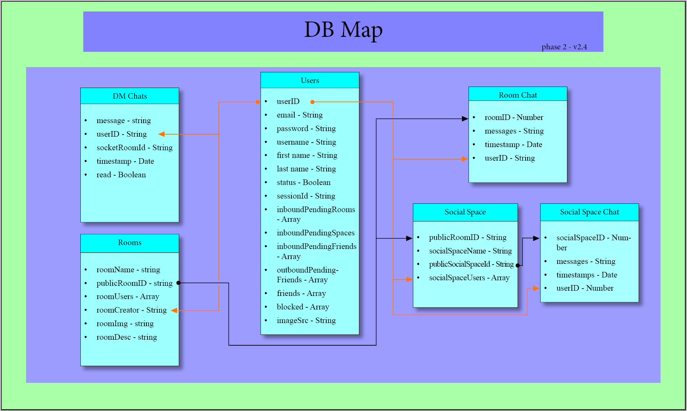

# Water Cooler

## Description
Lorem ipsum dolor sit amet, consectetur adipiscing elit. Nunc sollicitudin est sit amet lacus pulvinar, mollis tincidunt mauris pharetra. Sed id ipsum est. Nam faucibus metus et nisl placerat hendrerit. Sed congue elit nunc, et pulvinar lacus placerat non. Vestibulum lacinia scelerisque orci at luctus. Sed orci massa, rutrum id finibus eget, venenatis hendrerit neque. Proin vel libero in nisi auctor mollis eget non arcu.

## Table of Contents

* [Usage](#Usage)
* [Development](#Development)
* [Server](#Server)
* [Client](#Client)
* [Tests](#Tests)
* [Bugs](#Bugs)
* [Future Development](#Future-Development)
* [License](#License)
* [Contributors](#Contributors)

## Usage (User Stuff and Whatnot)

Lorem ipsum dolor sit amet, consectetur adipiscing elit. Nunc sollicitudin est sit amet lacus pulvinar, mollis tincidunt mauris pharetra. Sed id ipsum est. Nam faucibus metus et nisl placerat hendrerit. Sed congue elit nunc, et pulvinar lacus placerat non. Vestibulum lacinia scelerisque orci at luctus. Sed orci massa, rutrum id finibus eget, venenatis hendrerit neque. Proin vel libero in nisi auctor mollis eget non arcu.

## Development

* [Available Scripts](#Available-Scripts)
* [Dependencies/Packages](#Dependencies/Packages)

Lorem ipsum dolor sit amet, consectetur adipiscing elit. Nunc sollicitudin est sit amet lacus pulvinar, mollis tincidunt mauris pharetra. Sed id ipsum est. Nam faucibus metus et nisl placerat hendrerit. Sed congue elit nunc, et pulvinar lacus placerat non. Vestibulum lacinia scelerisque orci at luctus. Sed orci massa, rutrum id finibus eget, venenatis hendrerit neque. Proin vel libero in nisi auctor mollis eget non arcu.

### Available Scripts

These are some of the key scripts used during development. Linting rules and test must pass, as we use Travis CI to run these scripts before a PR can be merged.

| Plugin | README |
| ------ | ------ |
| npm start:server | begins server using nodemon |
| npm start:client | begin React server in dev mode |
| npm lint | uses eslint to check for linting errors |
| npm lint:fix | if an issue occors with eslint, this script can resolve the issue |
| npm test:server | run tests for the server |
| npm test:client | run tests for the client |

### Dependencies/Packages

#### Dependencies

```sh
[bcryptjs](https://www.npmjs.com/package/bcryptjs)

[bootstrap](https://www.npmjs.com/package/bootstrap)

[concurrently](https://www.npmjs.com/package/concurrently)

[dotenv](https://www.npmjs.com/package/dotenv)

[express](https://www.npmjs.com/package/express)

[express-session](https://www.npmjs.com/package/express-session)

[jsonwebtoken](https://www.npmjs.com/package/jsonwebtoken)

[mongoose](https://www.npmjs.com/package/mongoose)

[passport](https://www.npmjs.com/package/passport)

[passport-local](https://www.npmjs.com/package/passport-local)

[react-bootstrap](https://www.npmjs.com/package/react-bootstrap)

[react-icons](https://www.npmjs.com/package/react-icons)

[socket.io](https://www.npmjs.com/package/socket.io)

[socket.io-client](https://www.npmjs.com/package/socket.io-client)

[uuid](https://www.npmjs.com/package/uuid)

[yarn](https://www.npmjs.com/package/yarn)

```

#### Dev Dependencies

```sh
[eslint](https://www.npmjs.com/package/eslint)

[jest](https://www.npmjs.com/package/jest)

[nodemon](https://www.npmjs.com/package/nodemon)

[supertest](https://www.npmjs.com/package/supertest)

```

## Server

* [Database](#Database)
* [Routes](#Routes)
* [Authentication](#Authentication)
* [GUI](#GUI)
* [Video and Chat](#Video-and-Chat)

### Database



#### Models

#### Seeds

### Routes

#### Managing Friends

### Authentication

### GUI

## Client

* [PWA](#PWA)
* [App.jsx](#App.jsx)
* [Components](#Components)

### PWA

### App.jsx

### Utilities and Data

### Components


* [GUI Components](#GUI-Components)
* [Sidebar](#Sidebar)

#### GUI Components

#### Sidebar

> [Back To Components](#Components) || [Back To Client](#Client) || [Back To Table of Contents](#Table-of-Contents)

## Tests

## Bugs

* If a user creates a room without entering in the required info for the database the room is not entered into the db but the user is still routed to a room using the uuid

TabFriends passes prop data to ProfileModal that triggers a react warning

## Future Development

## Contributors

### About Us

### Reference

## License
